# Lab 2 - Build an AI-Powered Customer Service Platform

**Objective**

Build an AI-powered customer service platform for NovaCom Telecom using
Power Apps, Power Automate, and Microsoft Copilot Studio over a single
Dataverse table, enabling customer service agents to manage their ticket
queue, critical incidents to escalate themselves, customers to check and
raise tickets conversationally, and supervisors to monitor activity from
a generated dashboard — removing manual triage and the disconnected
tools that slow ticket handling today.

**Solution Focus Area**

- NovaCom Telecom, a telecommunications provider, handles a steady flow
  of customer support tickets spanning outages, billing, connectivity,
  and service requests. Agents work their queue without a purpose-built
  console, ticket priority is assessed by eye, and critical incidents
  sit alongside routine ones until someone happens to notice them.

- Because ticket data, escalation decisions, and customer updates are
  handled separately, total-loss-of-service issues can wait in the queue
  before reaching the escalation team, the duty manager is notified only
  when an agent remembers to do it, and customers have no way to check
  progress other than calling support. Team leads have no consolidated
  view of open tickets, priority mix, or current escalations to manage
  workload with.

- To address these gaps, NovaCom aims to bring ticket capture,
  escalation, self-service, and supervision onto one platform, using the
  Dev One developer environment so that every component reads and writes
  the same Dataverse ticket records rather than its own copy.

**Solution**

An end-to-end Power Platform solution built on a single Dataverse table
will modernise customer service at NovaCom Telecom by:

- **Establishing the Data Layer:** The **Service Tickets** table will be
  created in Dataverse by importing NovaCom_ServiceTickets.csv, holding
  Ticket Number, Ticket Title, Customer Name, Customer Email, Issue
  Category, Priority, Status, Description, Assigned Agent, Created Date
  and Resolved Date, with Priority and Status kept as text so the
  automation and the agent can evaluate and write those values directly.

- **Giving Agents a Working Queue:** The **Active Service Tickets** view
  will be configured to show the columns agents need, sorted by Created
  Date descending and filtered to exclude Resolved tickets, and surfaced
  through the **NovaCom Service Console** model-driven app with a
  two-column form that places customer context on the left and
  operational fields such as Priority, Status and Assigned Agent on the
  right.

- **Automating Escalation:** The **NVC Ticket Triage and Escalation**
  flow will watch the Service Tickets table for new rows, and when
  Priority equals Critical, set the ticket Status to Escalated, assign
  it to the Escalation Team, and email the duty manager a \[CRITICAL\]
  notification requesting acknowledgement within 30 minutes.

- **Delivering Customer Self-Service:** The **NovaCom Support
  Assistant** in Copilot Studio, grounded in the Service Tickets table
  as a Dataverse knowledge source, will return ticket status in a fixed
  format, refuse to invent a ticket number, status, agent or date,
  acknowledge frustrated customers, and open every conversation with a
  welcome message and suggested prompts.

- **Enabling the Agent to Act:** The **NVC Create Support Ticket** agent
  flow will write a new ticket to Dataverse with a generated NVC-TKT-
  reference after the assistant collects the customer's name, email,
  issue category and description — meaning a Critical ticket raised in
  conversation passes straight into the same escalation automation.

- **Providing Supervisor Visibility:** A **Supervisor Dashboard** built
  with Generative Pages from a plain-English description will render KPI
  cards, a priority breakdown chart, and a live escalations list inside
  the Service Console, refined conversationally and checked with the
  Accessibility assistant before publishing.

- **Delivering It Where Users Work:** The published assistant will be
  added to the Microsoft 365 and Teams channel, so a customer can
  describe a problem in conversation, have a ticket written to
  Dataverse, escalated, notified to the duty manager, and reflected on
  the supervisor dashboard without a NovaCom employee touching it.

## Exercise 1: Activate the Power Apps Developer Plan and Select the Lab Environment

In this exercise, you will activate a **Power Apps Developer Plan** and
select the **developer environment** that will host all solution
components created throughout the lab. Using the same environment for
**Power Apps**, **Power Automate**, and **Copilot Studio** ensures that
the agent console, automation flows, and AI agent can seamlessly access
and share a single Dataverse table, providing a unified customer service
solution.

- Using Microsoft Edge, navigate to the Power Apps product page:
  +++https://www.microsoft.com/en-in/power-platform/products/power-apps+++.

- On the **Power Apps** product page, select **Try for free**.

- In the **Let's get started** pane, enter the Microsoft 365 tenant
  email provided for the lab and select the required check box.

- Select **Start free** to begin the **Developer Plan** sign-up process.

  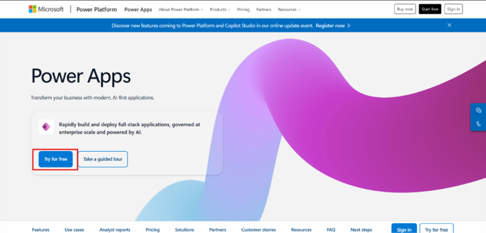

- In the **Enter password** field, enter the administrator password, and
  then select **Sign in.**

  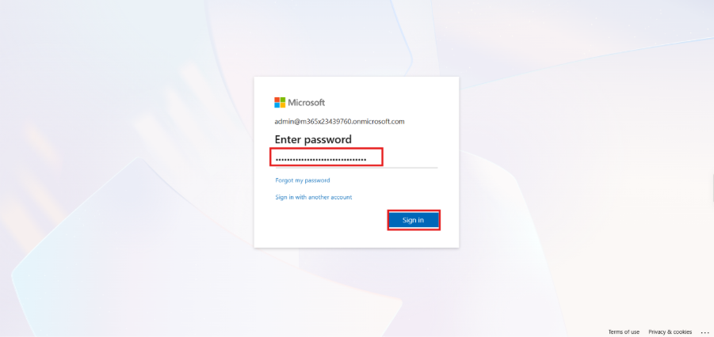

- After the **Power Apps** home page loads, verify that the welcome
  message confirms the **Developer Plan** is active.

  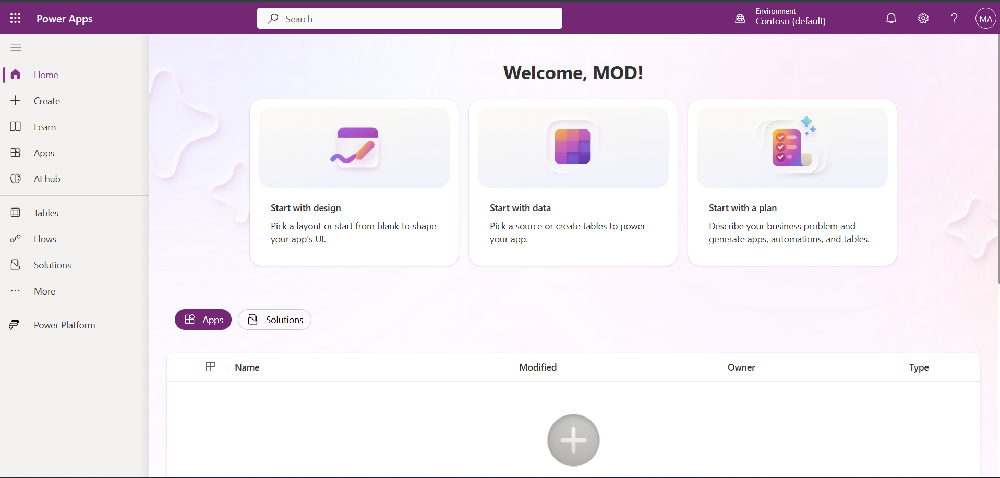

- Select the **Environment** picker in the upper-right corner of the
  **Power Apps** portal.

- From the **Build apps** with Dataverse section, select the **Dev One**
  environment.

- Verify that **Dev One** is the active environment before continuing.
  Do not use the Contoso (default) environment, as certain Copilot
  Studio and Generative Pages features used in this lab are not
  available there.

  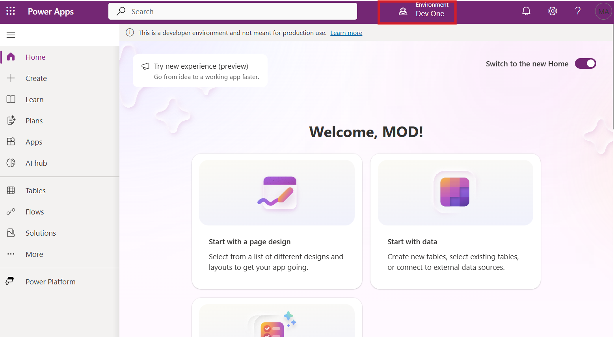

  > **Note:** Make a note of the region shown beside the selected
  environment name, as it will be used later in Exercise 13.

- Verify that the **Power Apps Developer Plan** is active and that the
  Dev One environment is selected. This environment will be used
  throughout the remaining exercises in this lab.

## Exercise 2: Create the Service Tickets Table from CSV

In this exercise, you will create the **Service Tickets** Dataverse
table by importing data from a CSV file. This table serves as the
central data source for the solution and is used throughout the lab by
the agent console, automated workflows, Copilot Studio agent, and
supervisor dashboard. By creating a shared Dataverse table, all
components can access and work with the same customer service data.

- In the **Power Apps** navigation pane, select **Tables**.

- On the command bar, select **New table**, and then select **Create new
  tables**.

  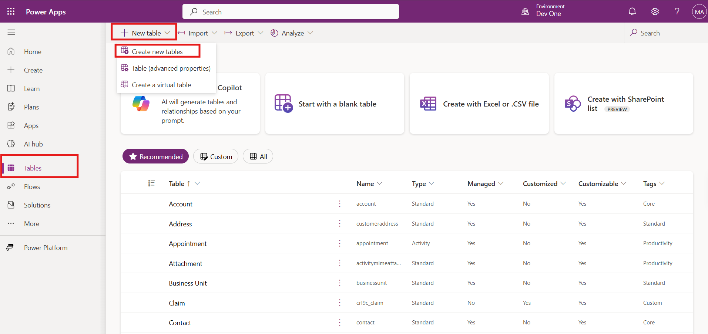

- On the Choose an option to create tables page, select Import an Excel
  file or .CSV.

  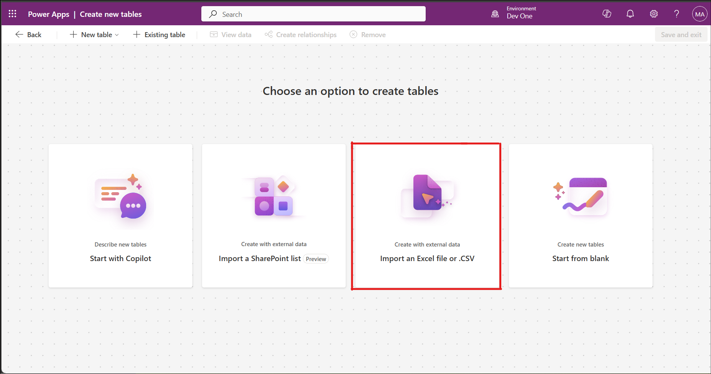

- In the Import an Excel or .CSV file dialog, select Select from device.

  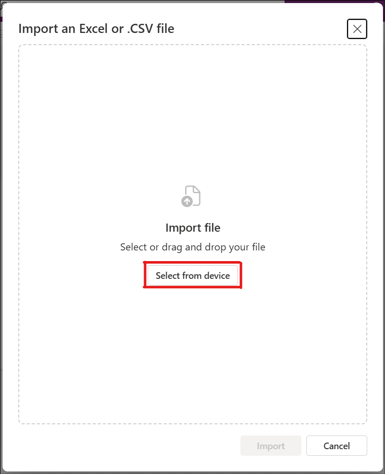

- Select **NovaCom_ServiceTickets.csv** from the **C:\labfiles** folder,
  and then select **Open**.

  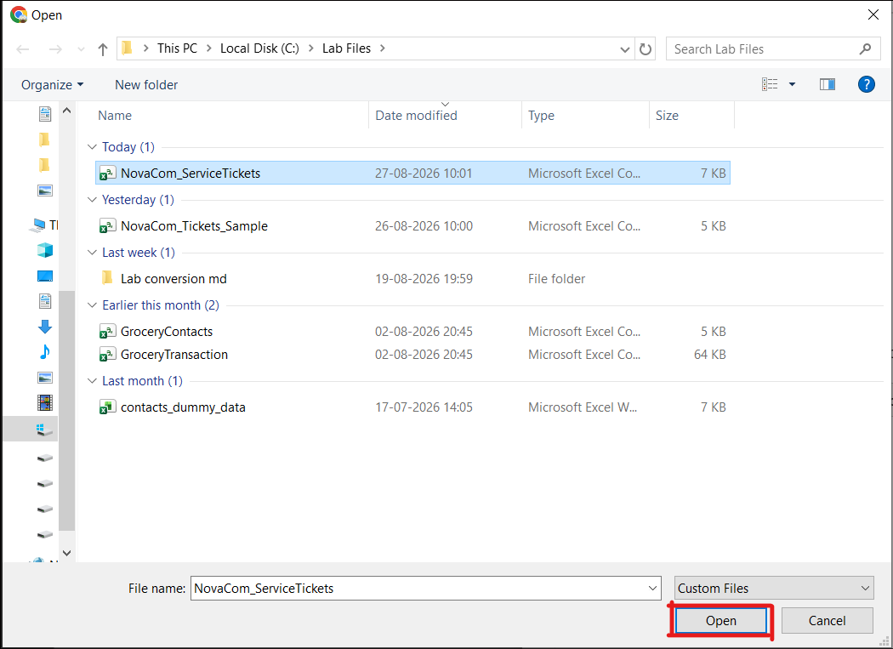

- Verify that the file is listed and that **Include** is enabled, and
  then select **Import**.

  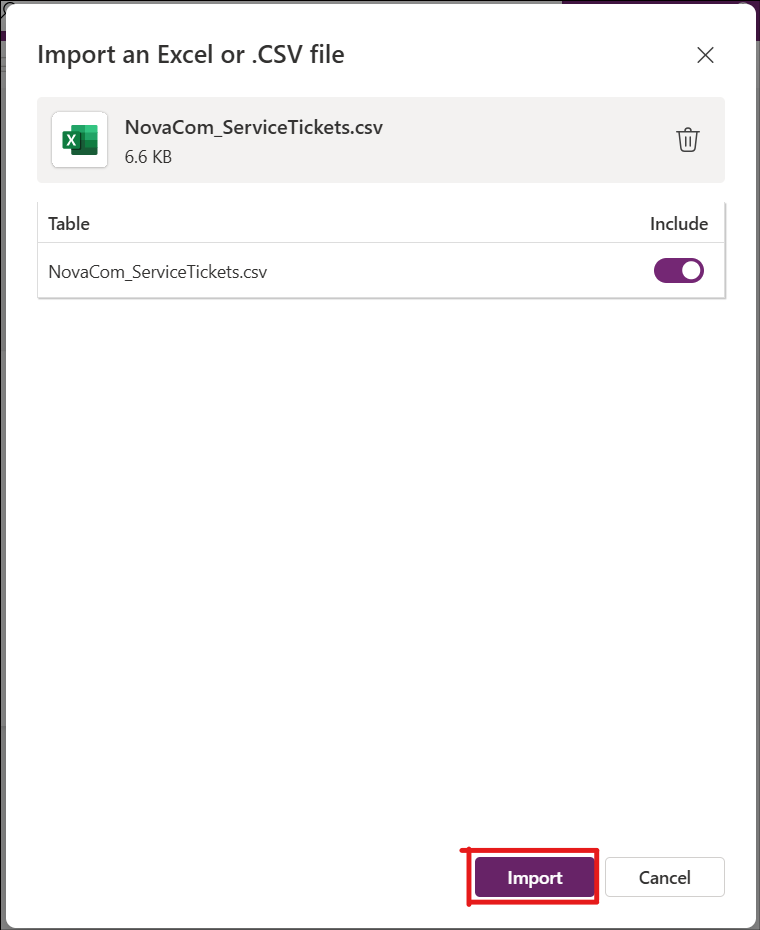

- Wait for Power Apps to process the file and generate the table. After
  the table is created, select the table name and rename it to **Service
  Tickets**.

  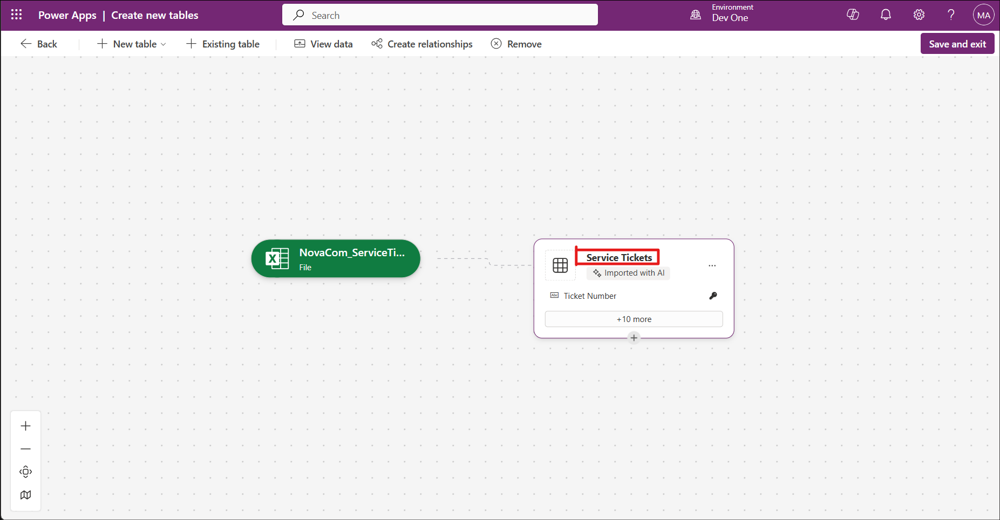

- On the **Service Tickets** table card, select **More options (…)**,
  and then select **View data**.

  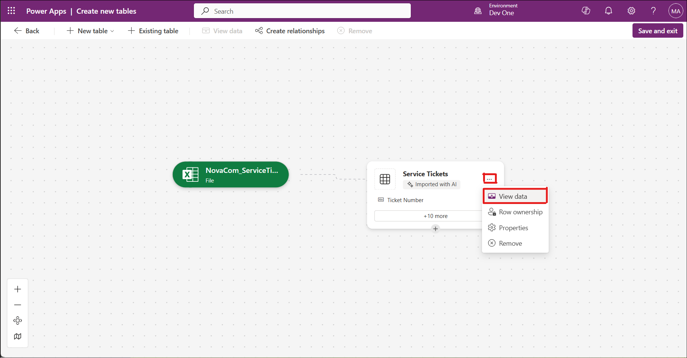

- Verify that the data type for each column matches the values shown
  below. If a change is required, select the column header, select
  **Edit column**, update the **Data type**, and then select **Update**.

  - **Ticket Number** — Single line of text

  - **Ticket Title** — Single line of text

  - **Customer Name** — Single line of text

  - **Customer Email** — Single line of text, Format set to Email

  - **Issue Category** — Single line of text

  - **Priority** — Single line of text

  - **Status** — Single line of text

  - **Description** — Multiple lines of text

  - **Assigned Agent** — Single line of text

  - **Created Date** — Date and time, Format set to Date only

  - **Resolved Date** — Date and time, Format set to Date only

  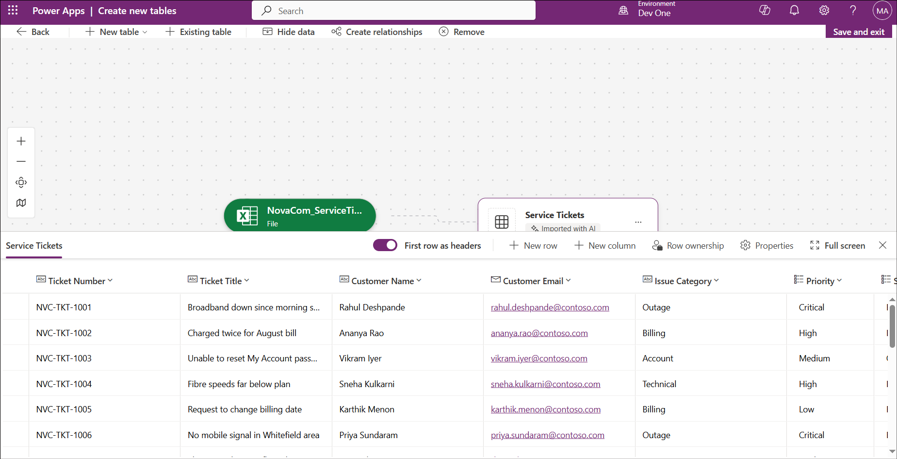

- Verify that the **Issue Category** column is configured as **Single
  line of text**. Do not convert this column to a Choice column.

  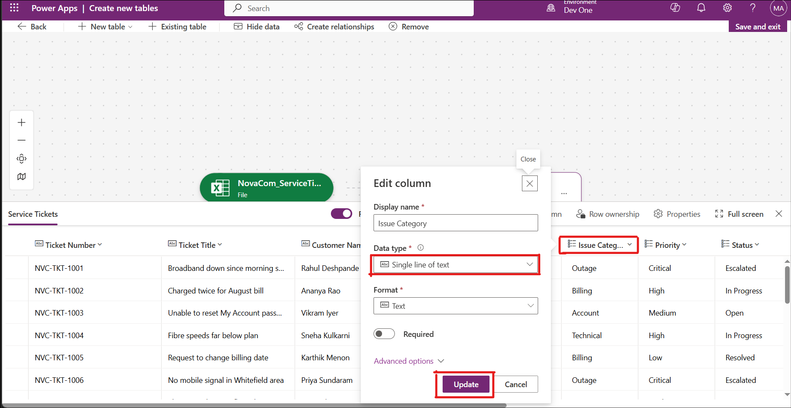

- Verify that the **Priority** column is configured as **Single line of
  text**. Do not convert this column to a **Choice** column, as the
  automation flow created later in the lab evaluates priority values
  such as **Critical** as plain text.

  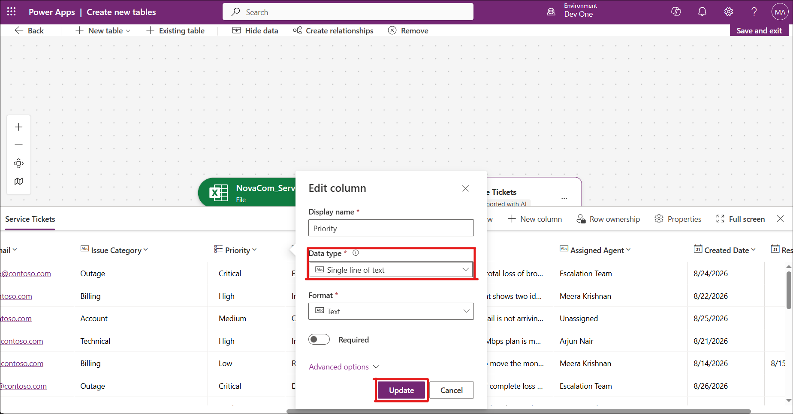

- Verify that the **Status** column is configured as **Single line of
  text**. Do not convert this column to a **Choice** column, as the
  Copilot Studio agent updates status values by writing plain text to
  the column.

  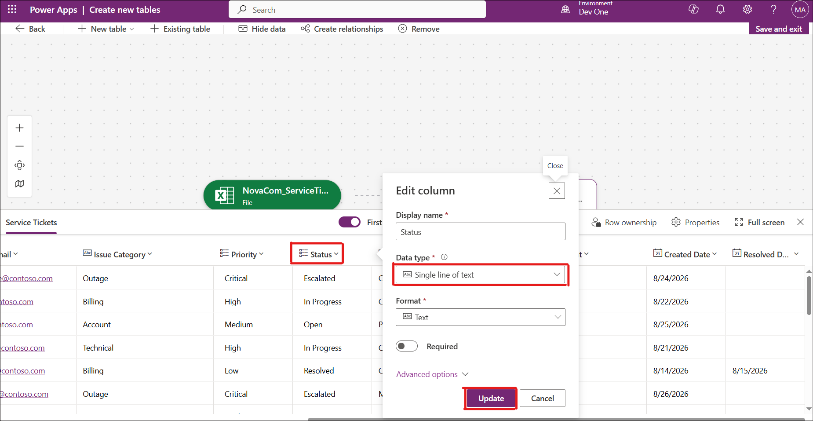

- Verify that the **Resolved Date** column is configured as **Date and
  time** with the Format set to **Date only**. If the column is
  configured as Single line of text, select the column header, select
  **Edit column**, change the data type to **Date and time**, set the
  format to **Date only**, and then select **Update**.

  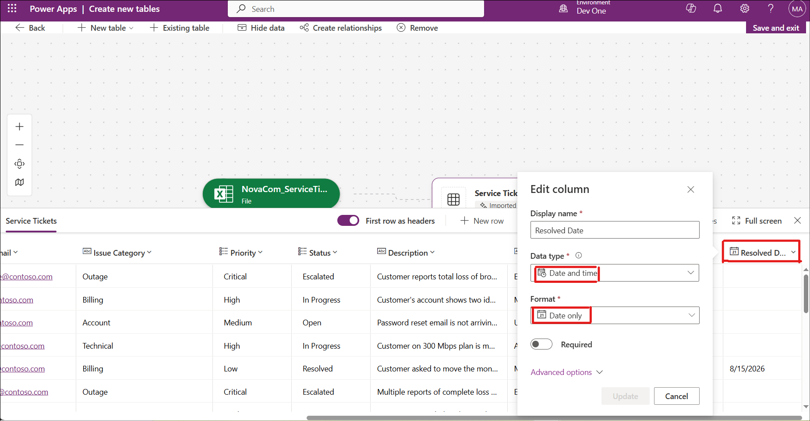

- On the command bar, select **Save and exit**.

- In the Done working? dialog, select **Save and exit**.

  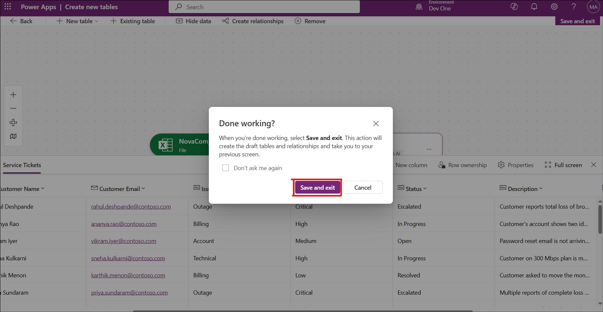

- Reopen the **Service Tickets** table and verify that **24 records**
  are present. Confirm that each ticket number begins with NVC-TKT-.

- The **Service Tickets** table has been successfully created from the
  CSV file, with all columns configured correctly and **24 sample
  ticket** records imported into Dataverse.

  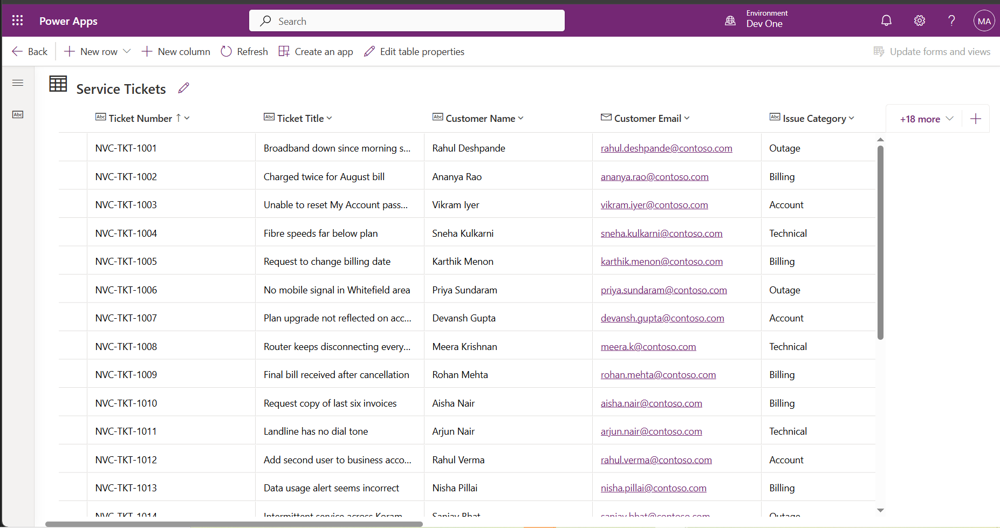

## Exercise 3: Prepare the Active Service Tickets View

In this exercise, you will configure the default view for the **Service
Tickets** table to display the information that customer service agents
need to see. Model-driven apps display data through **Dataverse views**,
not directly from the table. As a result, only the columns included in a
view are visible to users. Configuring the view ensures that agents can
quickly access key ticket information such as the ticket number, title,
customer name, priority, and status when working in the app.

**Open the View Designer**

- In the **Power Apps** navigation pane, select **Tables**, and then
  select the **Service Tickets** table.

  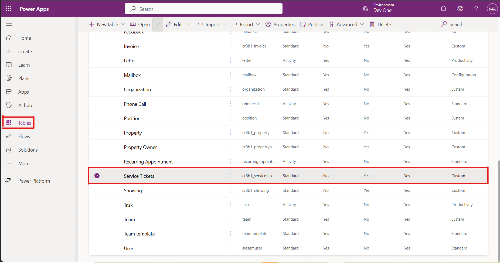

- On the **Service Tickets** table page, locate the **Data experiences**
  section. This section includes **Forms**, **Views**, **Charts**, and
  **Dashboards**.

  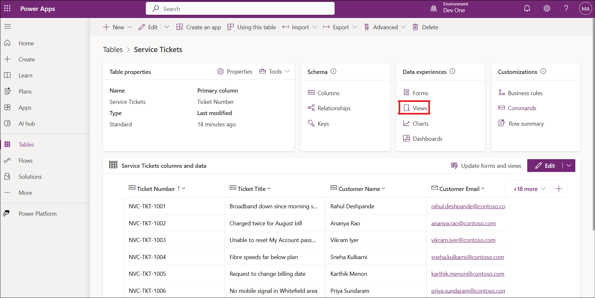

- Select **Views**. The list of available views for the **Service
  Tickets** table is displayed, including the **Active Service Tickets**
  view.

  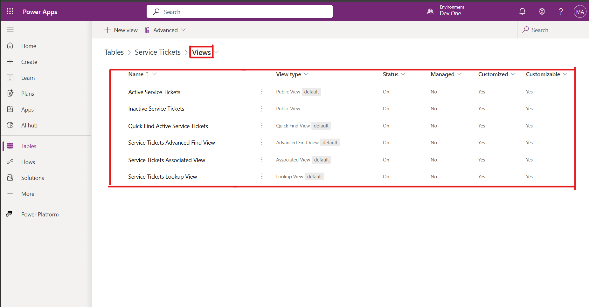

- Select **Active Service Tickets**. The view designer opens in a new
  browser tab and displays a preview of the view, along with the **Table
  columns pane**.

  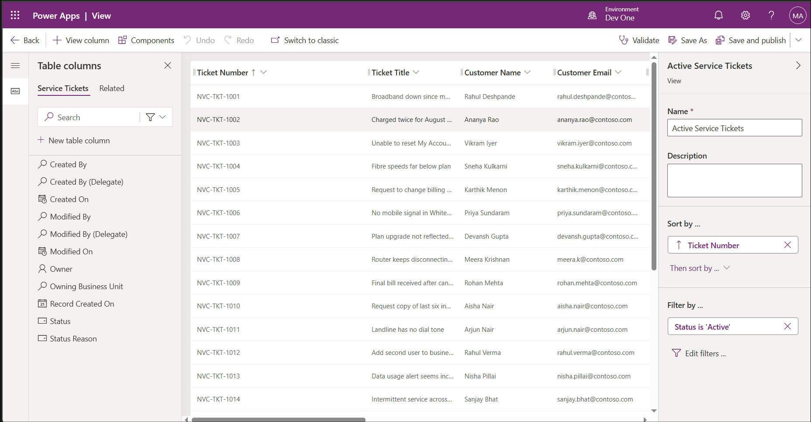

**Confirm and Add the Columns**

> **Note:** Depending on the import results, some columns may already be
included in the view. The **Table columns** pane displays only columns
that are not currently in the view. If a column does not appear in the
search results, it may already be present in the view. This behaviour is
expected.

- Scroll to the far right of the preview grid, and then review the
  column headers currently included in the view.

- The view should include the following columns. Review the columns
  already displayed in the preview grid, and identify any columns that
  are already present.

  - Ticket Number

  - Ticket Title

  - Customer Name

  - Issue Category

  - Priority

  - Status

  - Assigned Agent

  - Created Date

- For each column that is not already included in the view, enter the
  column name in the Table columns search box, and then select the
  column from the search results. The column is added to the end of the
  preview grid**.**

- If the search returns No match found, the column is already included
  in the view. Continue to the next column.

  > **Note**: If you add a column by mistake, select the column header, select **More options (...)**, and then select **Remove**.

  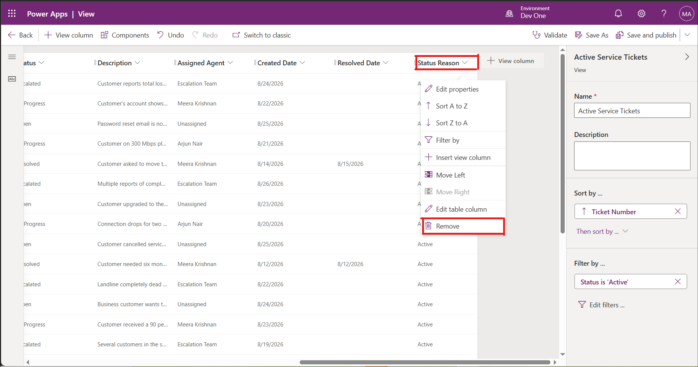

**Sort and Filter the View**

- In the Properties pane, under Sort by, remove any existing sort
  criteria. Select Created **Date and** then set the sort order to
  Descending so that the most recently created tickets appear first.

  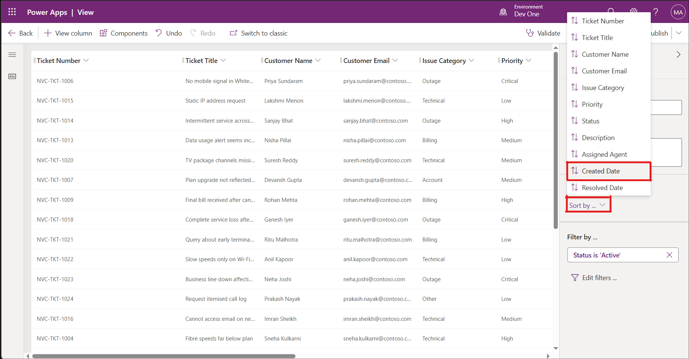

- In the Properties pane, under Filter by, select Edit filters.

- Select + Add, and then select Add row. Configure the filter with the
  following values:

- Column: Status

- Operator: Does not equal

- Value: +++Resolved+++

- Select OK to save the filter. Verify that resolved tickets are no
  longer displayed in the preview grid and that only active tickets
  remain visible.

  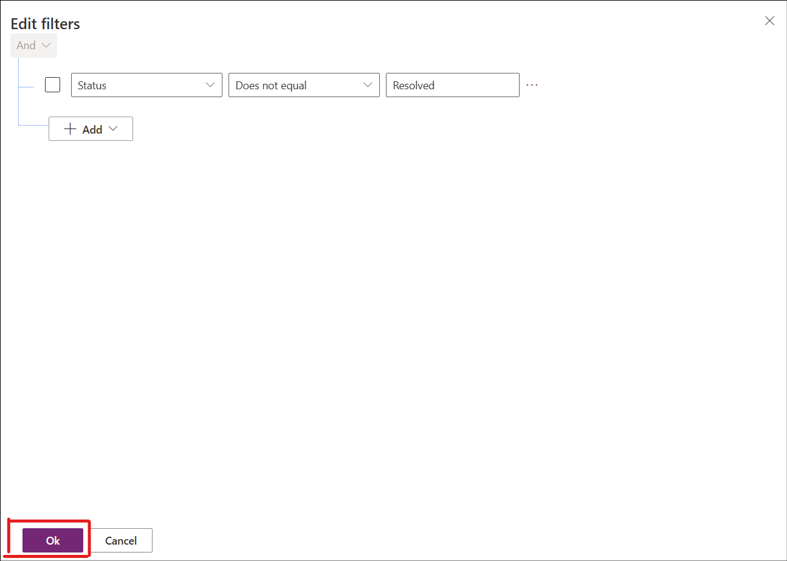

- On the command bar, select **Save and publish**.

> **Note:** The **Save and publish** command save the view and publishes
> the changes in a single action. Publishing makes the updated view
> available in the model-driven app.

  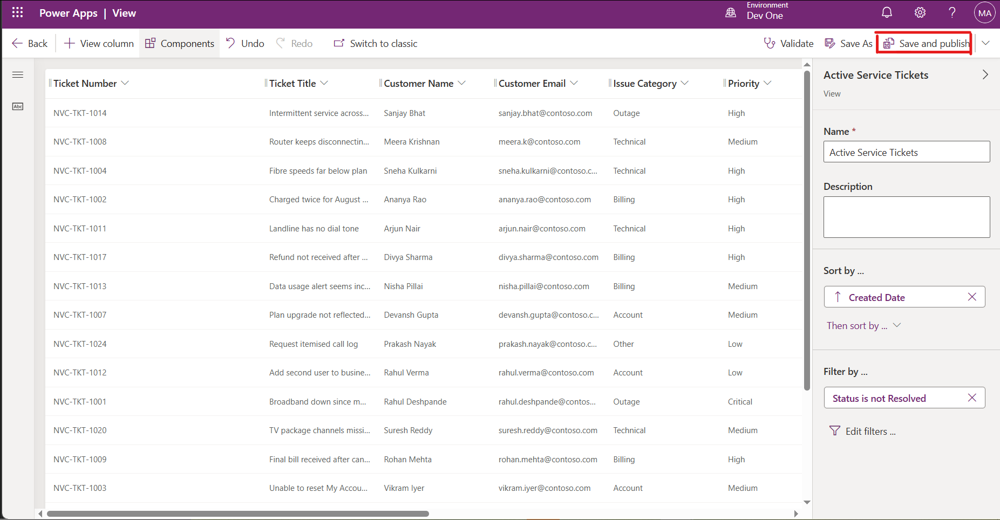

- Close the **Active Service Tickets** view designer tab, and then
  return to the **Power Apps** browser tab.

- The **Active Service Tickets** view displays the columns required by
  customer service agents, is sorted by **Created Date** in descending
  order, and excludes tickets with a Status of Resolved.

  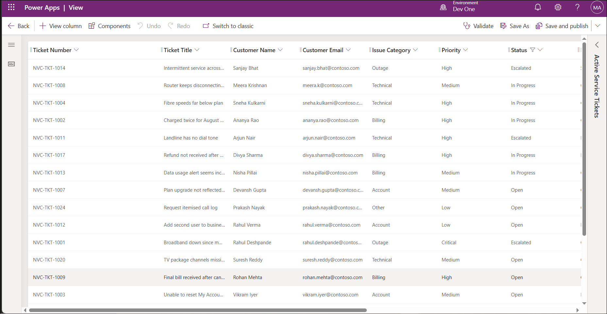

## Exercise 4: Build the NovaCom Service Console Model-Driven App

In this exercise, you will create the **NovaCom Service Console**
model-driven app that customer service agents use to manage and update
service tickets. Model-driven apps automatically generate a user
interface based on Dataverse tables, forms, and views, reducing the need
for manual screen design. You will configure the app to include the
**Service Tickets** table and publish it so agents can access and work
with their ticket queue.

- In the Power Apps navigation pane, select **+ Create**.

- Under Start from design, select Blank app with navigation.

  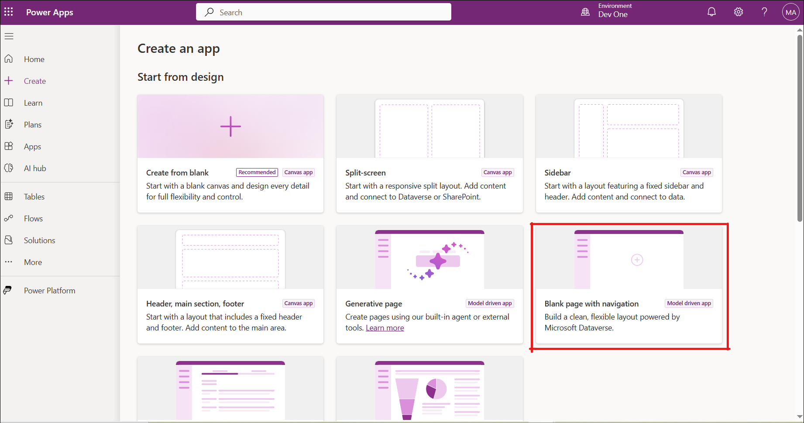

- In the New app dialog, enter +++NovaCom Service Console+++ in the Name
  field.

- Select **Create** and then wait for the app designer to open.

  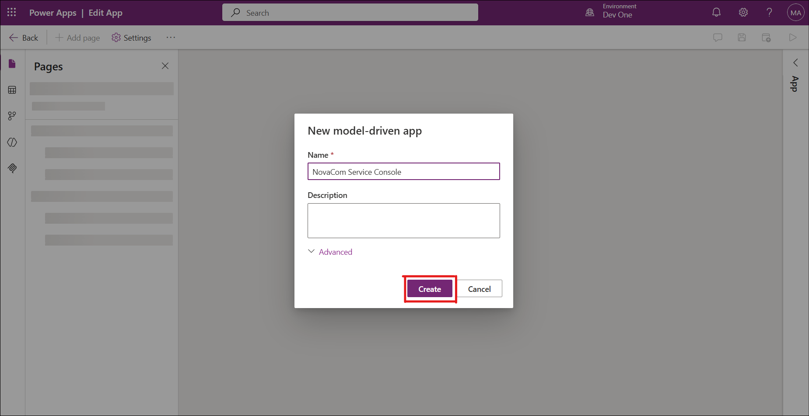

- In the app designer, select **+ Add page**. On the **Add page** pane,
  select **Dataverse table**.

  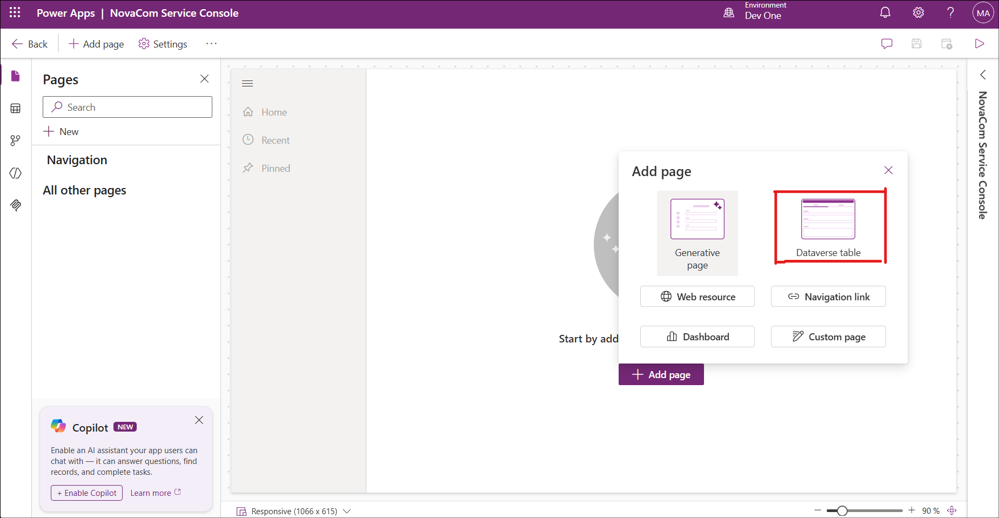

- In the **Add page** pane, search for and select the **Service
  Tickets** table, and then select **Add**.

- In **Pages** panel, select **Service Tickets** page.

- In the **Properties** pane, verify that **Active Service Tickets** is
  selected as the default view. If a different view is selected, choose
  **Active Service Tickets** from the View list.

  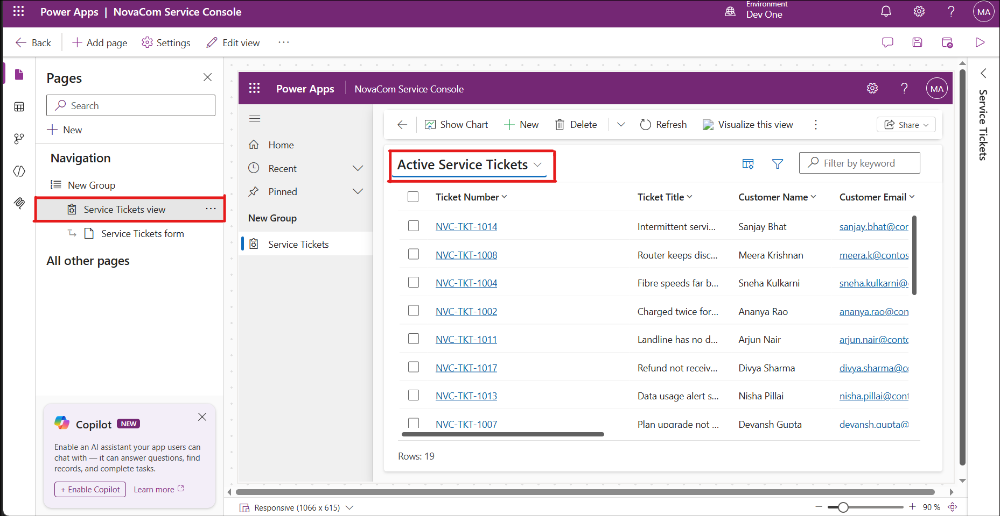

- On the command bar, select Save. After the app is saved, select
  **Publish** to make the app available to users.

  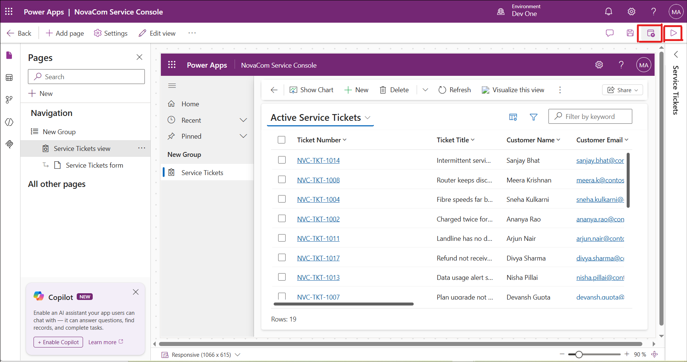

- Select Play to open the app. Verify that the **Active Service
  Tickets** view displays 19 active tickets.

- Confirm that the following columns are visible in the ticket list:

  - Ticket Number

  - Title

  - Customer Name

  - Issue Category

  - Priority

  - Status

  - Assigned Agent

  - Created Date

  The **NovaCom Service Console** app opens successfully and displays the
Active Service Tickets view with **19** **active** **tickets** and all
required columns.

  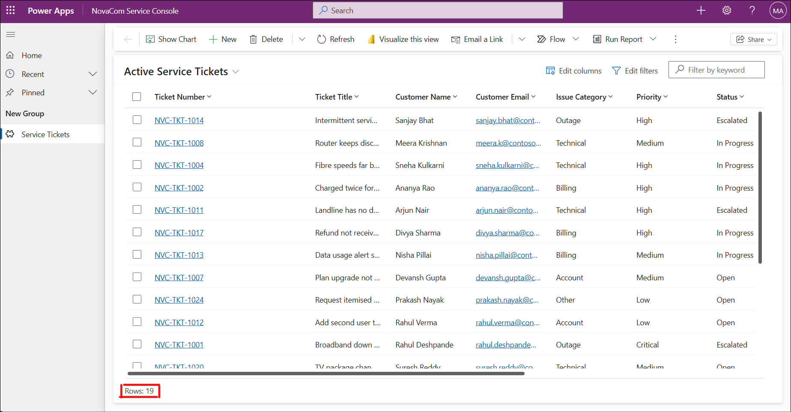

- Select a ticket to open the record and then verify that the ticket
  details load successfully.

  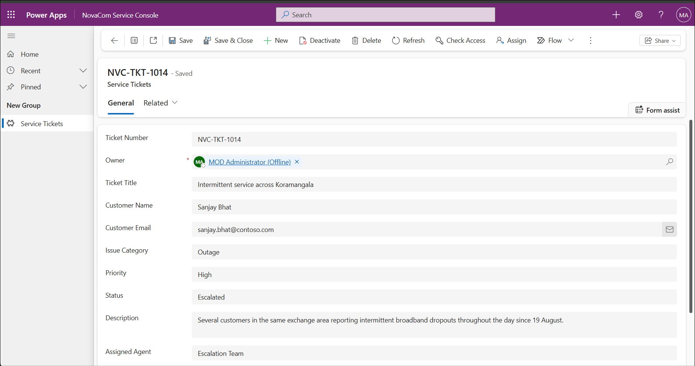

- Close the app tab and then return to the app designer.

The **NovaCom Service Console** model-driven app has been created and
published successfully, providing customer service agents with a
functional ticket management workspace.

## Exercise 5: Configure the Service Ticket Form

In this exercise, you will customize the **Service Tickets** form to
improve the agent experience. You will arrange the form into a
two-column layout, placing customer and ticket information on the left
and operational fields such as **Priority**, **Status**, and **Assigned
Agent** on the right. This layout helps agents view key information and
update tickets more efficiently without excessive scrolling.

- In the **Power Apps** navigation pane, select **Tables**, and then
  select the **Service Tickets** table.

- In the **Data experiences** section, select **Forms**.

  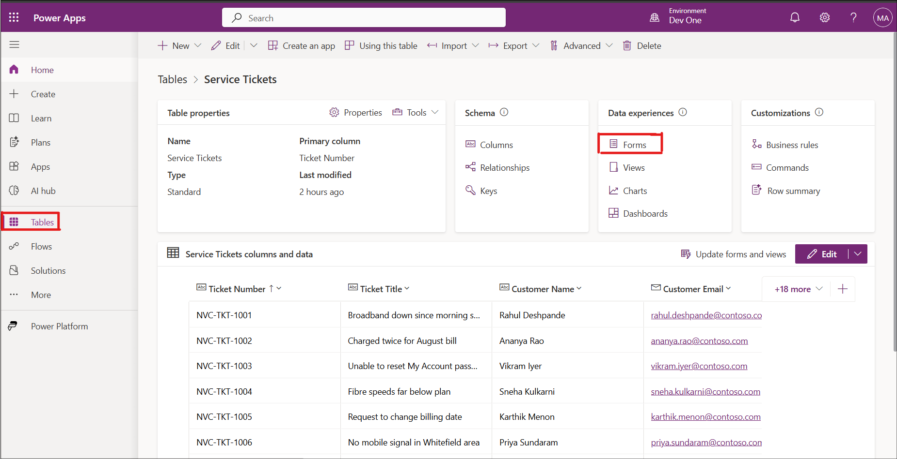

- Select the **Information (Main)** form. The form designer opens.

  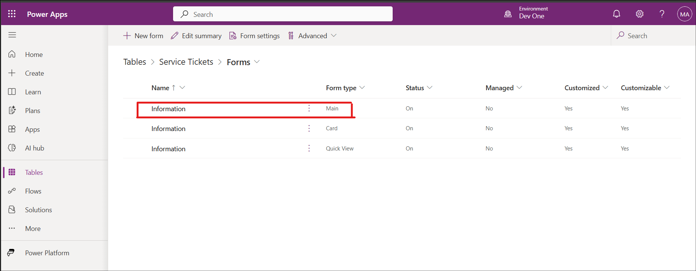

- In the form designer, select the existing section on the form canvas.

- In the **Properties** pane, under **Formatting**, set **Columns** to
  2.

  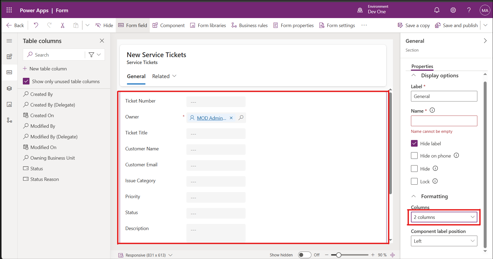

- From the **Table** **columns** pane, drag the following fields to the
  left column of the form, in the order shown below:

  - Ticket Number

  - Customer Name

  - Customer Email

  - Issue Category

  - Description

- Drag the following fields into the **right** column, in this order:

  - Priority

  - Status

  - Assigned Agent

  - Created Date

  - Resolved Date

  > **Note**: If a field is already present on the form, it will not appear
in the **Table columns** pane. In this case, select the field on the
form canvas and move it to the appropriate column and position instead.

  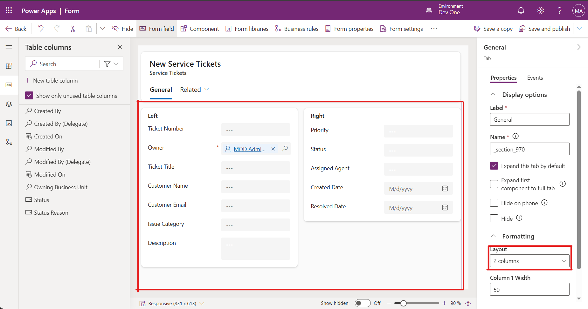

- On the command bar, select **Save and publish**.

- Close the form designer, open the **NovaCom Service Console**, and
  open any ticket. Confirm the two-column layout appears.

  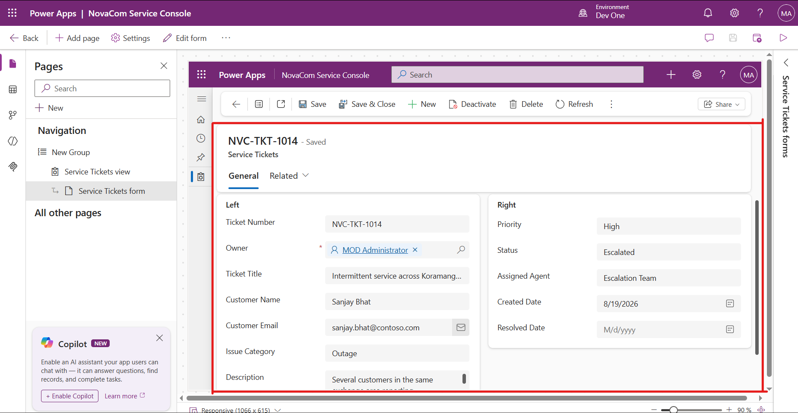

Conclusion: The **Service Tickets** form displays customer information
and operational fields in a two-column layout, allowing agents to view
customer context and manage tickets more efficiently.

## Exercise 6: Build the Ticket Triage and Escalation Flow

In this exercise, you will create an automated workflow that escalates
critical service tickets. Currently, critical issues remain in the queue
until an agent identifies and processes them. By using **Power
Automate**, you will configure a flow that automatically detects new
tickets with a **Priority** value of **Critical**, reassigns them to the
escalation team, and notifies the duty manager by email. This ensures
that high-priority incidents receive immediate attention, regardless of
whether the ticket is created by an agent, imported into Dataverse, or
submitted through the support assistant.

**Create the Flow and Trigger**

- Open a new browser tab and then navigate to the Power Automate portal
  at **+++https://make.powerautomate.com+++.**

- Verify that **Dev One** is selected in the Environment picker in the
  upper-right corner. If a different environment is selected, switch to
  **Dev One** before continuing.

  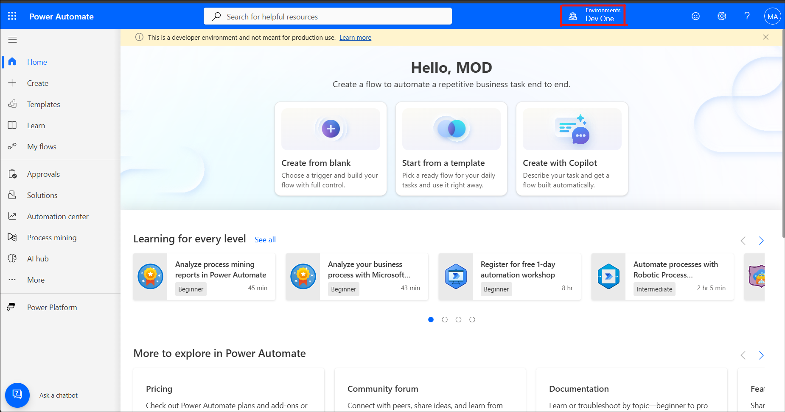

- In the **Power Automate** navigation pane, select **Create**. On the
  **Create** page, select **Automated** cloud flow.

  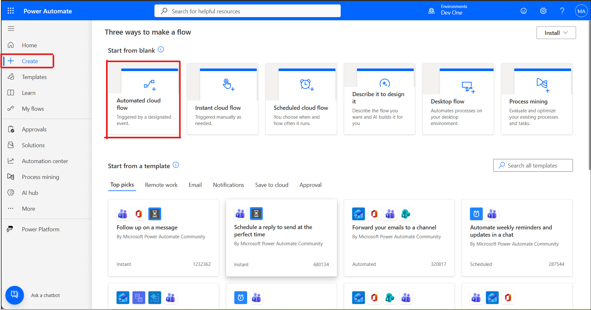

- In the Flow name field, enter +++NVC Ticket Triage and Escalation+++.

- In the Choose your flow's trigger search box, enter +++**When a row is
  added**+++, and then select **When a row is added**, **modified** or
  **deleted** from **Microsoft Dataverse**.

- Select **Create**.

  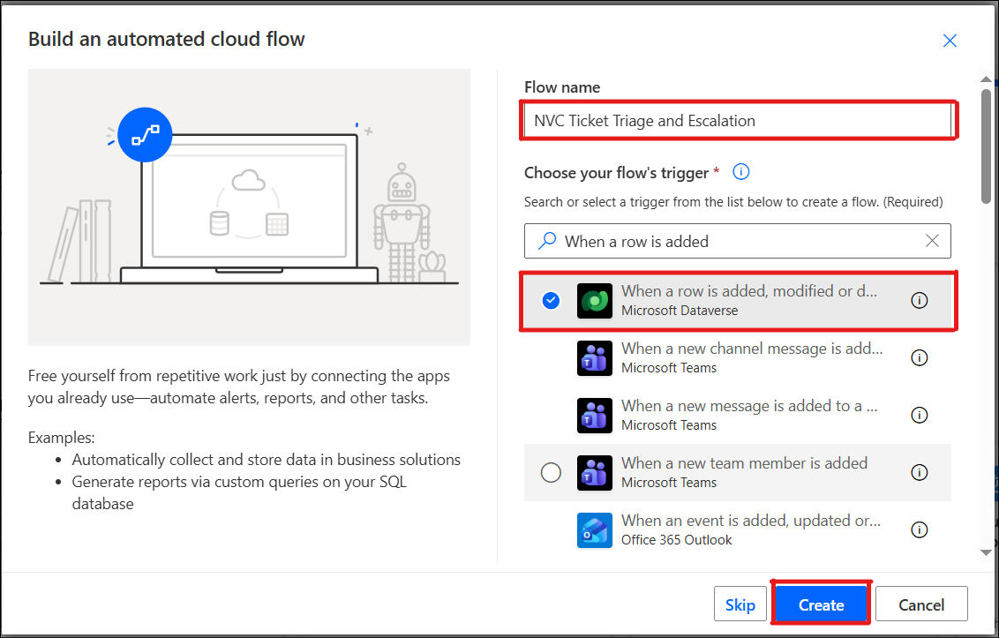

- Configure the **When a row is added**, **modified or deleted** trigger
  with the following values:

  - Change type — Added

  - **Table name** — Service Tickets

  - **Scope** — Organization

  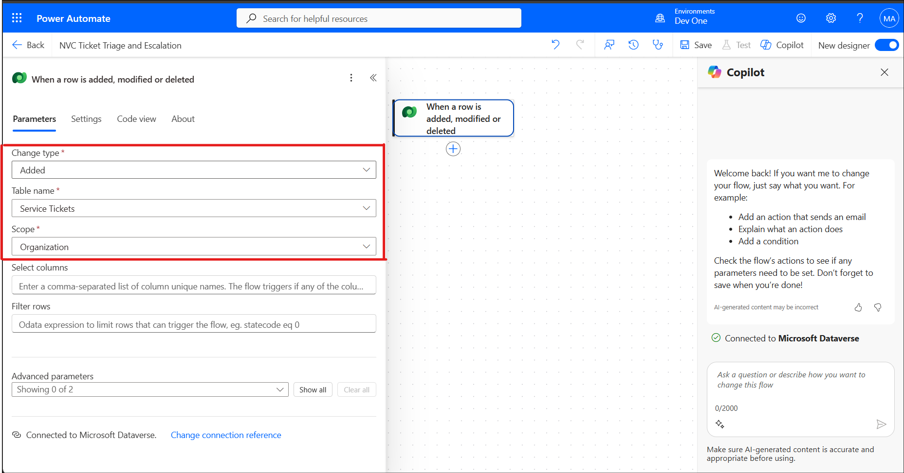

**Add the Priority Condition**

- Below the trigger, select **+**, and then select **Add an action**.

- In the search box, enter **+++Condition+++**, and then select
  **Condition** under **Control**.

- In the left **Choose** **a value** field, select the **Dynamic
  content** icon, and then select **Priority** from the trigger outputs.

- Leave the operator set to **is equal to**.

- In the right **Choose** **a value** field, enter **Critical**.

  > Note: The **Priority** column must be configured as **Single line of
text**. The condition checks for the text value **Critical** and is
case-sensitive. Ensure the value matches the data in the **Service
Tickets** table exactly.

  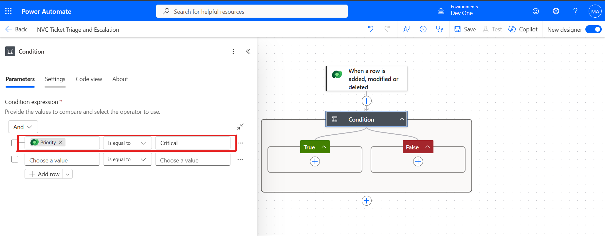

**Configure the Escalation Branch**

- In the **If yes** branch of the condition, select **Add an action**.

- Search for +++Update a row+++, and then select Update a row under
  Microsoft Dataverse.

- Configure the action with the following values:

  - Table name: Service Tickets

  - Row ID: Select the ticket's unique identifier from the trigger
    outputs. Depending on your environment, this value may appear as
    Service Ticket or Unique identifier.

- Select Show all under Advanced parameters.

- In the Status field, enter **+++Escalated+++**.

- In the Assigned Agent field, enter **+++Escalation Team+++**.

  > **Note**: The **Update a row** action updates the ticket that triggered
the flow, changing its status and assigning it to the escalation team
when the priority is **Critical**

  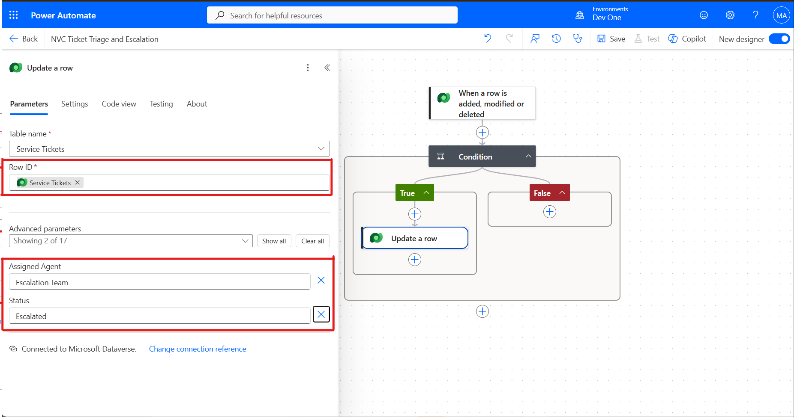

- In the **True** branch, select **Add an action**.

- Below the Update a row action, select Add an action. Search for Send
  an email, and then select Send an email (V2) under Office 365 Outlook.

- In the **To** field, enter your lab administrator email address. This
  email address will be used to verify that the notification is sent
  successfully.

- In the **Subject** field, enter the following text, and then insert
  the Ticket Title dynamic content at the end:

- +++\[CRITICAL\] NovaCom ticket escalated - +++

- Select the **Body** field and enter the following text, replacing each
  bracketed value with dynamic content where indicated:

- +++A Critical priority ticket has been raised and automatically
  escalated. Ticket Number: \[Ticket Number\] Title: \[Ticket Title\]
  Customer: \[Customer Name\] Email: \[Customer Email\] Category:
  \[Issue Category\] Description: \[Description\] This ticket has been
  assigned to the Escalation Team. Please acknowledge within 30 minutes
  in the NovaCom Service Console.+++

  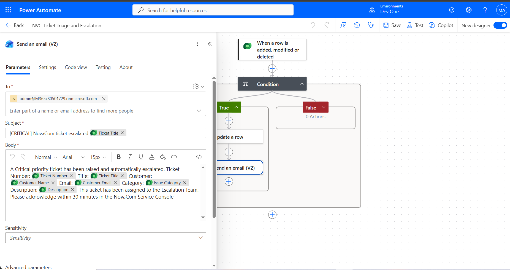

- Leave the **False** branch empty. Non-critical tickets will continue
  through the standard ticket queue process.

- On the command bar, select **Save**, and then verify that the flow
  saves successfully and that no actions display validation errors.

Conclusion: The **NVC Ticket Triage and Escalation** flow is configured
and saved successfully. Any new ticket with a **Priority** value of
**Critical** will be automatically escalated, assigned to the escalation
team, and trigger an email notification.

## Exercise 7: Test the Triage Flow End to End

In this exercise, you will raise a critical ticket in the Service
Console and confirm that the flow escalates it without anyone touching
it.

- In **Power Apps**, select **Apps**, and then open the **NovaCom
  Service Console** app.

- On the command bar, select **+ New** to create a new service ticket.

  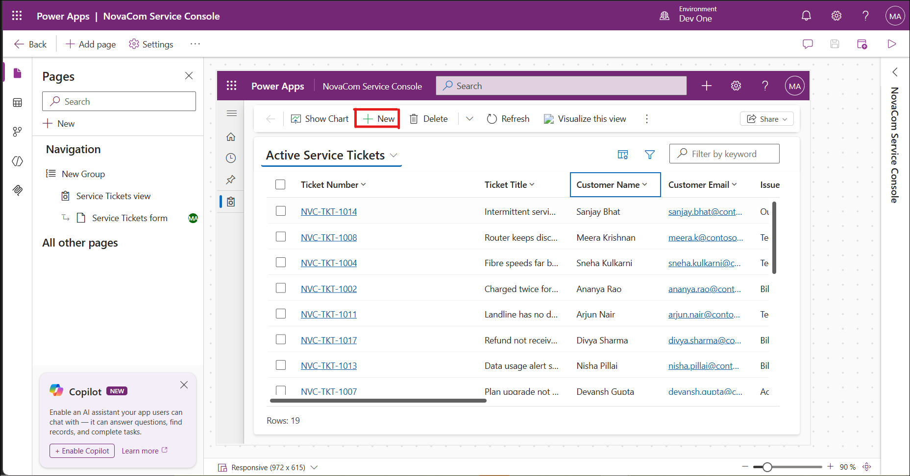

- Complete the form with the following values:

  - **Ticket Number** — +++NVC-TKT-9001+++

  - **Ticket Title** — +++Total service loss at branch office+++

  - **Customer Name** — +++Test Customer+++

  - **Customer Email** — your own lab admin email address

  - **Issue Category** — +++Outage+++

  - **Priority** — +++Critical+++

  - **Status** — +++Open+++

  - **Description** — +++All connectivity lost at the branch office. No
    voice or data services available.+++

- Select **Save**.

  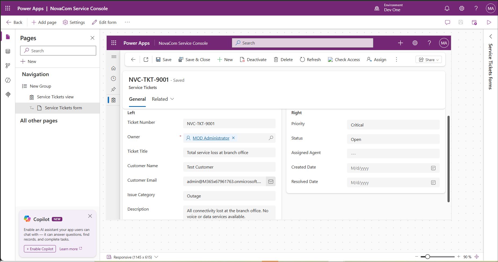

- Wait approximately one to two minutes for the flow to run. Then select
  **Refresh** on the command bar and reopen the ticket.

- Verify that the following values have been updated automatically:

  - Status: Escalated

  - Assigned Agent: Escalation Team

  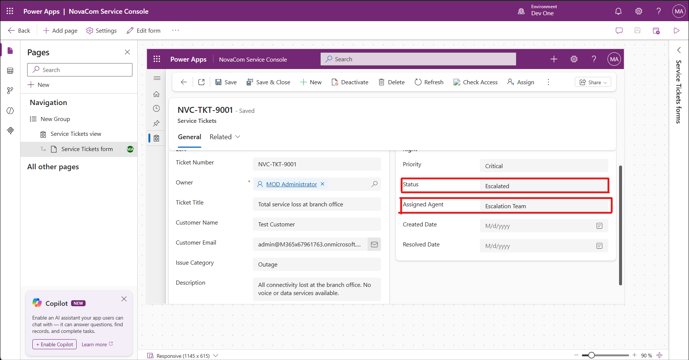

- Check your mailbox and then verify that the escalation notification
  email has been received. Confirm that the email subject begins with
  **\[CRITICAL\]**.

- Return to Power Automate, open **My flows**, select **NVC Ticket
  Triage and Escalation**, and verify a successful run appears in the
  **28-day run history**.

  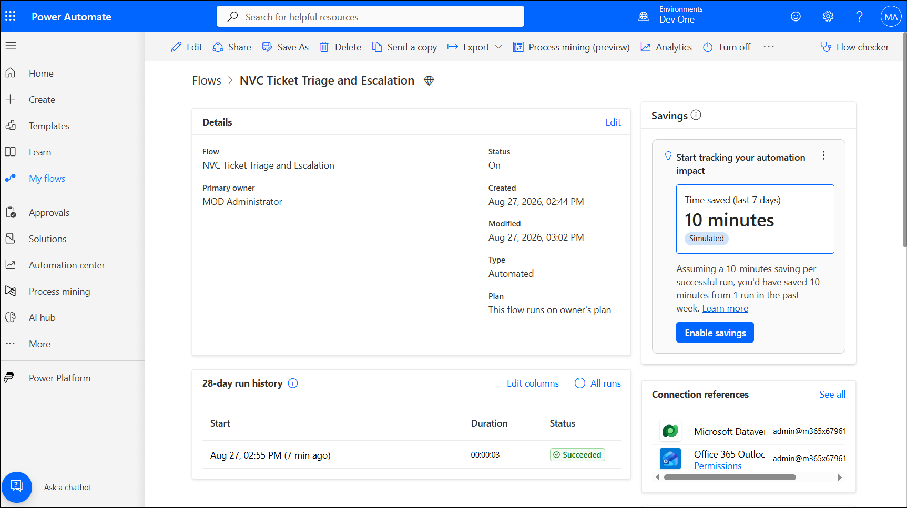

- If the ticket was not updated, review the flow run history and verify
  that the condition evaluated to **True**. A mismatch between the
  **Priority** value in the ticket and the value **Critical** in the
  condition is the most common cause of a failed match.

**Conclusion**: Critical tickets are automatically escalated and trigger
a notification email without requiring agent intervention.

## Exercise 8: Activate the Copilot Studio Trial and Create the Support Assistant

In this exercise, you will activate the Copilot Studio trial and switch
Copilot Studio to the same developer environment used in Power Apps.
Copilot Studio opens in the default environment, so the environment must
be changed before any agent is created.

1.  Open a new browser tab and navigate to
    +++https://www.microsoft.com/en-us/microsoft-365-copilot/microsoft-copilot-studio+++
    the Microsoft Copilot Studio product page.

2.  Select Sign in to Copilot Studio.

    

3.  Enter M365 admin tenant ID in the **Sign in** field, then select
    **Next**.

    

4.  Enter the password in the **Enter password** field, then select
    **Sign in**.

    

5.  When prompted with **Stay signed in?**, click **Yes**.

    

    > Note: If Copilot studio navigate to new Copilot Studio portal, Turn off the new exeperience button.

      

      

6.  Wait while Copilot Studio loads. The address bar shows that the
    portal has opened in the **Default** environment.

    

7.  Open a new browser tab and navigate to
    **+++https://admin.powerplatform.microsoft.com+++** the Power
    Platform admin centre.

8.  From the left navigation, select **Manage**, then select
    **Environments**, then select **Dev One**.

    

9.  On the **Dev One** details page, copy the **Environment ID** value.

    

10. Return to the Copilot Studio tab, replace the environment identifier
    in the address bar with the copied **Environment ID**, then press
    **Enter**.

    

11. On the Select a team dialog, click start a trial.

    

12. Under Let's get you started, click Continue.

  

13. On the setup screen, provide the required information, then click
    **Get Started**:

    1.  Select your **Country or Region** from the dropdown list

    2.  Enter your **Job title** to indicate your role

    3.  Enter a Company name

    4.  Enter a valid Business phone number

  

14. On the Confirmation details step, click Get Started.

  

15. Confirm the Copilot Studio home page loads and that the environment
    selector shows **Dev One**.

  

The Copilot Studio trial is active and the portal is running in the same
Dev One environment that holds the Dataverse tables.

## Exercise 9: Create the NovaCom Support Assistant

- In the **Copilot Studio** navigation pane, select **Agents**.

- On the command bar, select **Create blank agent**.

- In the Name your agent dialog, enter +++NovaCom Support Assistant+++.

- Select **Create** and then wait for the agent to be provisioned.

  

- On the agent **Overview** page, in the **Details** card, click
  **Edit**.

- Select the **Description** field and enter the following text, then
  click **Save**:

  - +++Helps NovaCom Telecom customers check the status of an existing
    support ticket, understand what happens next, and raise a new ticket
    when an issue cannot be resolved through self-service.+++

- Scroll to the **Instructions** card and select **Edit**.

- Select **Edit** in the instructions field and enter the following
  text, then click **Save**:

  - +++You are the NovaCom Support Assistant, the customer service agent
    for NovaCom Telecom. Help customers check the status of an existing
    ticket and raise a new ticket when they need one. Response format
    rules: for a ticket status query, always return Ticket Number,
    Ticket Title, Issue Category, Priority, Status, Assigned Agent, and
    Created Date. When several tickets match, return a formatted table
    and lead with the most recent. Behaviour rules: only answer from
    NovaCom Service Tickets data and never invent a ticket number,
    status, agent name, or date. If a ticket number is not found, say
    that you cannot locate it and ask the customer to check the number.
    Never discuss another customer ticket. When raising a new ticket,
    always collect the customer name, email address, issue category, and
    a description of the problem before creating it, and set priority to
    Critical only when the customer has a total loss of service. Be
    professional, concise, and empathetic, and acknowledge the customer
    situation in one sentence before answering when they are frustrated.
    Keep responses under 150 words unless a table is clearer. If you
    cannot help, tell the customer to call NovaCom support on
    1800-NOVACOM.+++

  

- On the command bar in the top-right corner, select **Settings**.

- Under **Moderation**, set the **Content moderation** level slider to
  **Medium**, then select **Save**.

- When the **Changes saved** confirmation appears, click **Close (X)**
  to return to the agent.

The **NovaCom Support Assistant** is created and configured with the
response format and behaviour rules it applies to every customer answer.

## Exercise 10: Add the Service Tickets Knowledge Source and Welcome Message

In this exercise, you will connect the **Service Tickets table** to the
agent as a Dataverse knowledge source and set a welcome message that
tells customers what the assistant can do. No topic is authored — the
agent answers directly from live ticket data.

**Add the Knowledge Source**

- In the **NovaCom Support Assistant**, from the command bar, select
  **Knowledge**.

- Select Add knowledge.

- In the **Add knowledge** dialog, select **Dataverse**.

  

- In the search field, enter **+++Service Tickets+++** select the
  checkbox beside **Service Tickets**, then select **Add to agent**.

- Record the logical table name shown beneath the display name, for
  example **crf9c_ServiceTickets**. This value identifies the table in
  the citations the agent returns.

- Wait until the knowledge source status shows **Ready**. This can take
  one to two minutes.

  

**Set the Welcome Message**

- On the command bar, select **Topics**, and then select the **System**
  tab.

- Select the **Conversation Start** topic to open it on the canvas.

  

- Select **Message** node, delete the existing text, and enter the
  following:

  - +++Hello and thank you for contacting NovaCom Telecom. I can check
    the status of an existing support ticket, tell you which agent is
    handling it, explain what happens next, and raise a new ticket if
    you need one. If you have a ticket number, it looks like
    NVC-TKT-1001. How can I help you today?+++

- On the command bar, select **Save**.

  

- The agent has live access to every **NovaCom ticket** and opens each
  conversation by stating what it can do.

## Exercise 11: Build and Register the Create Support Ticket Tool

In this exercise, you will build an agent flow that writes a new ticket
to Dataverse, then register that flow as a tool on the support
assistant. This moves the agent from answering questions to taking
action — and because the triage flow from Exercise 6 watches the same
table, a Critical ticket raised in conversation escalates itself
automatically.

**Create the Agent Flow**

- In the **NovaCom Support Assistant**, from the command bar, select
  **Tools**.

- Select Add a tool.

  

- In the Add tool dialog, under Create new, select Add new Workflows.

  

- On the trigger card When an agent calls the flow, click Add an input.

- Under Choose the type of user input, select Text.

- In the input name field, enter the following name:
  **+++CustomerName+++**

- Repeat the previous steps to add the following four inputs:

  - +++CustomerEmail+++ — Text

  - +++IssueCategory+++ — Text

  - +++IssueDescription+++ — Text

  - +++TicketPriority+++ — Text

  

**Add the Dataverse Row Action**

- On the canvas, click + icon below the trigger card.

- In the Add an action search box, enter +++Add a new row+++ and select
  Add a new row from Microsoft Dataverse.

- In the Table name dropdown, select **Service Tickets**, then select
  **Show all** beside Advanced parameters.

- Select **Ticket Number** field, select the ***fx*** icon, enter the
  following expression, then click **Add**:

  +++concat('NVC-TKT-', formatDateTime(utcNow(),'yyyyMMddHHmmss'))+++

- Map the remaining fields using **Dynamic content** from the trigger:

  - **Ticket Title** — IssueDescription

  - **Customer Name** — CustomerName

  - **Customer Email** — CustomerEmail

  - **Issue Category** — IssueCategory

  - **Priority** — TicketPriority

  - **Description** — IssueDescription

- In the **Status** field, type the following static value:
  **+++Open+++**

- In the **Assigned Agent** field, type the following static value:
  **+++Unassigned+++**

- Click into the **Created Date** field, select the ***fx*** icon, enter
  **+++utcNow()+++** and click **Add**.

  

**Return the Result and Publish**

- On the Respond to the agent card, click Add an output.

- Under Choose the type of output, select Text.

- In the output name field, enter the following name:
  **+++TicketConfirmation+++**

- Select the value field and enter the following text, inserting the
  **Ticket Number** dynamic content from the Add a new row action where
  indicated:

  > **+++Your ticket \[Ticket Number\] has been raised and a NovaCom agent
  > will be in contact shortly.+++**

- On the command bar, select **Save draft**.

- Select the flow name at the top of the designer and enter the
  following name: **+++NVC Create Support Ticket+++**

- On the command bar, select **Save draft**, then select **Publish**.

  

**Register the Flow as a Tool**

- Return to the NovaCom Support Assistant, select Tools, then select Add
  a tool.

- Select the **Flow** filter, then select **NVC Create Support Ticket**.

- Select Add and configure.

- Click into the **Description** field and enter the following text,
  then select **Save**:

  - +++Raises a new NovaCom support ticket in the service desk when a
    customer issue cannot be resolved through self-service. Use this
    after collecting the customer’s name, email address, issue category
    and a description of the problem.+++

  

- The description is what tells the orchestrator when to call this tool,
  so it must describe both the action and the information required
  before calling it.

The support assistant can now raise a real ticket in Dataverse rather
than only answering questions.

## Exercise 12: Add Suggested Prompts to the Agent

In this exercise, you will configure the prompts that appear on the
greeting screen, so a customer can get an answer without knowing what to
type.

- From the command bar, select **Overview**.

- Locate the Suggested prompts card and select **Add suggested prompt**.

- In the first prompt row, enter the following title and prompt:

  - Title: +++Check my ticket+++

  - Prompt: +++What is the status of ticket NVC-TKT-1002?+++

- In the second prompt row, enter the following title and prompt:

  - Title: +++Raise a new ticket+++

  - Prompt: +++I need to raise a ticket, my broadband has been down
    since this morning+++

- In the third prompt row, enter the following title and prompt:

  - Title: +++Open outages+++

  - Prompt: +++Which outage tickets are currently escalated?+++

- Select **Save**.

  

Conclusion: New users can now start a useful conversation with a single
click.

## Exercise 13: Validate the Agent Against Customer Queries

In this exercise, you will test the assistant against five realistic
customer queries and confirm it answers accurately from Dataverse,
refuses to invent information, and raises a real ticket when asked.

- In the top-right corner, select **Test** to open the test panel.

- Enter the following query and click the Send icon: +++What is the
  status of ticket NVC-TKT-1002?+++

- Confirm the agent returns the ticket number, title, category,
  priority, status, assigned agent, and created date, and cites the
  Service Tickets table.

  

- Enter the following query and click the Send icon: +++Which outage
  tickets are currently escalated?+++

- Confirm the agent returns only the escalated outage tickets, formatted
  as a table.

  

- Enter the following query and click the Send icon: +++What is the
  status of ticket NVC-TKT-9999?+++

- Confirm the agent says it cannot locate that ticket and asks you to
  check the number, rather than inventing a status.

  

- Enter the following query and click the Send icon: +++My broadband has
  been down since this morning and I work from home. I need help.+++

- Confirm the agent acknowledges the situation, then asks for the
  details it needs — name, email, and category — before raising
  anything. This is the behaviour rule from your instructions working as
  designed.

- Answer the agent’s questions using your own name, your lab admin email
  address, and the category **Outage**. When asked to confirm, agree to
  raise the ticket.

  

- Confirm the agent calls the **NVC Create Support Ticket** tool and
  returns a confirmation containing a new **NVC-TKT-** number.

- Open the **NovaCom Service Console** and confirm the new ticket exists
  in the ticket list.

- If you asked for the ticket to be raised as **Critical**, wait one to
  two minutes and confirm the triage flow from Exercise 6 has set its
  status to **Escalated** and emailed you. A ticket raised in
  conversation now flows through the same automation as one raised by an
  agent.

  

Conclusion: The **NovaCom Support Assistant** answers accurately from
live data, refuses to guess, and raises real tickets that enter the
existing escalation process.

## Exercise 14: Build the Supervisor Dashboard with Generative Pages

In this exercise, you will build the supervisor dashboard that NovaCom
team leads have never had, by describing it in plain English. Generative
Pages interprets the description, writes React and TypeScript code,
compiles it, and renders a working page inside the model-driven app.

Before starting, confirm your environment region is United States,
United Kingdom, Australia, or Singapore.

**Generate the Page**

- In Power Apps, select **Apps**, select the **…** menu beside **NovaCom
  Service Console**, and select **Edit** to open the app designer.

- In the app designer, select **+ Add page**.

- Select Generative page.

  

- Select **Describe a page**. The full-page authoring experience opens.

  

- Select Add data, then Add table.

  

- Search for and select **Service Tickets** and confirm it appears as a
  linked table.

- Leave **Include images** disabled — this dashboard does not need stock
  imagery.

  

- Open NovaCom_GenerativePage_Prompts.txt from C:\labfiles in Notepad.

- Copy the whole of **BLOCK 1** from the file and paste it into the
  prompt box.

  

- Click **Generate page** and watch the four build stages: thought
  streaming, code generation, transpiration, and final rendering. This
  takes 30 to 90 seconds.

- Read the thought streaming output as it appears. It shows how the
  agent interpreted your description before it wrote any code, which is
  the fastest way to spot a misunderstanding.

- When the build completes, review the **Preview** tab. Confirm the KPI
  cards, the priority bar chart, and the escalations list are populated
  with your 24 sample tickets.

  

**Refine the Page**

- The first generation is rarely exactly right. Refine it in
  conversation rather than in code.

- Copy **BLOCK 2** from the prompts file, paste it into the chat panel,
  and send it. Wait for the page to regenerate, then review the Preview
  tab.

- Confirm the four KPI cards are now equal width in a single row, and
  the **Total Escalated** card carries a red accent.

  

- Copy **BLOCK 3** from the prompts file, paste it into the chat panel,
  and send it.

- Confirm the priority chart now sits on the left and the escalations
  list on the right, below the KPI row.

  

- Optionally, select the **Code** tab to inspect the generated React and
  TypeScript, and select **Compared** to see the difference between this
  iteration and the previous one.

- Each refinement creates a new iteration, so you can always compare
  back. You do not need to get the first prompt perfect.

  

**Check Accessibility and Publish**

- Scroll to the bottom of the authoring canvas and locate the
  **Accessibility assistant** status indicator.

- If violations are listed, select **Open detailed results** to review
  them, then select **Auto fix** to pass them back to the agent for
  resolution.

  

  

- On the command bar, click **Save**.

- In the app designer, select the new page in the **Pages** panel and
  rename it to **+++Supervisor Dashboard+++**

- Click **Save**, then click **Publish**.

- Open the **NovaCom Service Console** and confirm **Supervisor
  Dashboard** appears in the app navigation and loads with live ticket
  data.

  

## Exercise 15: Publish the Agent to Microsoft 365 and Test End to End

In this exercise, you will publish the support assistant to Microsoft
365 and walk the complete journey one final time, confirming that all
four components you built are connected through the Service Tickets
table.

- Return to the Copilot Studio tab and open the **NovaCom Support
  Assistant**.

- On the agent **Overview** page, click **Publish**.

  

- In the **Publish this agent** dialog, review the listed items and
  click **Publish**. Wait for the publish to complete.

  

- Select **Channels**, then select the **Microsoft 365 and Teams**
  channel.

- Select Add channel.

  

- After the channel is added, select **See agent in Microsoft 365**.

  

- Select **Add** to add the agent in Microsoft 365.

  

- The agent is then added successfully.

  

- Select the suggested prompt **Check my ticket** and select the
  **Send** icon.

  

- Confirm the agent returns the same answer it gave in the Copilot
  Studio test panel.

  

- Enter the following query and click the Send icon: +++Which outage
  tickets are currently escalated?+++

  

- Enter the following and click the Send icon: +++I have lost all
  service at my office and cannot take card payments. This is urgent.+++

- Provide your name, your lab admin email address, and the category
  **Outage** when the agent asks, and confirm the ticket should be
  raised as **Critical**.

  

- Confirm the agent returns a new **NVC-TKT-** number.

  

- Complete the following final verification checklist:

- The new ticket appears in the **NovaCom Service Console** ticket list

- Within two minutes its Status reads Escalated and Assigned Agent reads
  Escalation Team

- An escalation email with the subject prefix **\[CRITICAL\]** has
  arrived in your mailbox

- The **Supervisor Dashboard** escalations list now includes the new
  ticket

  

That last check is the whole platform working as one. A customer
described a problem in conversation, an agent tool wrote it to
Dataverse, a flow escalated it and notified the duty manager, and a
supervisor dashboard picked it up — with no NovaCom employee involved at
any point.

## Conclusion

By delivering this platform, NovaCom Telecom brings ticket capture,
escalation, self-service, and supervision onto a single Dataverse table.
Agents work a filtered, purpose-built queue in the NovaCom Service
Console, critical incidents escalate themselves to the Escalation Team
and notify the duty manager within minutes, and customers can check
ticket status or raise a new ticket conversationally through the Support
Assistant in Microsoft 365 and Teams — with the assistant grounded in
live data so it never guesses a status or agent name. Team leads finally
have a Supervisor Dashboard showing KPIs, priority mix, and current
escalations, all built from a plain-English description. The result is a
ticket that can be reported, recorded, escalated, notified, and surfaced
for supervision without a NovaCom employee touching it, and a pattern —
Dataverse as the source of truth, Power Apps for user experiences, Power
Automate for process, and Copilot Studio for AI interaction — that
extends naturally to SLA tracking, knowledge management, satisfaction
surveys, and advanced reporting.
