# Lab 5: Building the Zava TalentHub AI-Driven Recruitment Portal with Copilot in Power Pages

**Objective**

Build a public-facing recruitment portal for NovaCorp using Copilot in
Microsoft Power Pages, Microsoft Dataverse, and Microsoft Copilot
Studio, enabling candidates to browse open roles, ask questions about
the hiring process at any hour, and submit an application online —
replacing the shared inbox, the manual Excel tracker, and the phone
calls the recruitment team relies on today.

**Solution Focus Area**

NovaCorp, a fast-growing technology company, employs 3,200 people across
eight offices in India and carries between 80 and 120 active job
openings at any given time. Its HR team, led by Talent Acquisition
Manager Aisha Nair, runs the entire hiring process on a shared email
inbox for applications, a manual Excel tracker for candidate status, and
phone calls to arrange interviews.

Because open roles, candidate records, and department information sit in
mailboxes and spreadsheets rather than one record store, candidates have
no way to see what is open, no way to apply online, and no way to find
out what happened to their application without emailing the recruitment
team and waiting. Every enquiry travels through a recruiter, and the
team spends its time answering the same questions instead of assessing
candidates.

To address these gaps, NovaCorp is introducing **Zava TalentHub** — a
professional public careers portal with an embedded conversational
agent, delivered by a Power Platform maker working in the Dev One
developer environment without writing application code.

**Solution**

- **Establishing the Data Layer:** The **Department**, **Jobs**, and
  **Applications** tables will be created in Dataverse by importing
  ZavaTalentHub_Departments.csv, ZavaTalentHub_Jobs.csv, and
  ZavaTalentHub_Applications.csv, with every column held as plain text,
  whole number, or date so that no lookup, choice, or relationship
  configuration is required anywhere in the lab.

- **Generating the Portal with Copilot:** The complete seven-page **Zava
  TalentHub** site — navigation, layout, sections, and theme — will be
  generated from a single natural language description in Power Pages,
  in under a minute.

- **Opening the Data to Visitors:** Three table permissions will grant
  anonymous visitors read access to Jobs and Department and create
  access to Applications, which is what makes Dataverse data render on a
  public page and a public form save.

- **Connecting Live Data to Pages:** A searchable Dataverse list on the
  **Open Roles** page and a Dataverse form on the **Apply Now** page
  will turn the generated brochure site into a working recruitment
  system.

- **Defining Agent Behavior and Grounding:** The **ZavaTalent** agent
  will be created in Copilot Studio with instructions that enforce a
  consistent role response format and stop it inventing roles, salaries,
  or deadlines, then grounded in the Jobs and Department tables as
  Dataverse knowledge sources without a single authored topic.

- **Delivering It Where Candidates Are:** The published agent will be
  embedded as a chat widget available to anonymous users, and Zava
  TalentHub will be published to the public internet so candidates can
  browse, ask, and apply in one place.

## Exercise 1: Activate the Power Apps Developer Plan and Select the Lab Environment

In this exercise, you will activate the free Power Apps Developer Plan
and select the developer environment that hosts every component you
build. Power Pages, Copilot Studio, and Power Automate must all point at
this same environment, because that is how the portal, the agent, and
the data share one Dataverse instance.

1.  Open your **Edge** browser and navigate to
    +++https://www.microsoft.com/en-in/power-platform/products/power-apps+++
    the Power Apps product page.

2.  On the product page, locate and click the **Try for free** button.

    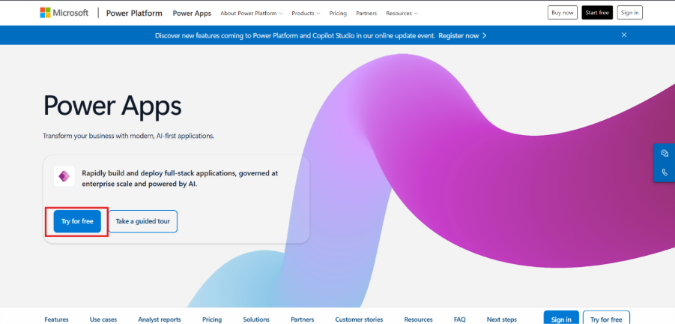

3.  In the **Let's get started** panel, enter the M365 admin tenant ID
    in the email field, then select the check box.

4.  Click **Start free** to begin the Developer Plan sign-up.

    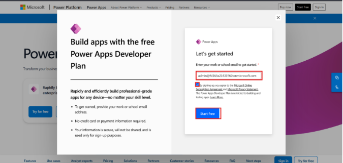

5.  Enter the administrator password in the **Enter password** field,
    then click **Sign in**.

    

6.  Wait for the Power Apps home page to load. The welcome message
    confirms that the Developer Plan is active.

    

7.  In the top-right corner, click the **Environment** selector.

8.  Under **Build apps with Dataverse**, select **Dev One**. Do not use
    the **Contoso (default)** environment — several Power Pages and
    Copilot Studio features are unavailable there.

    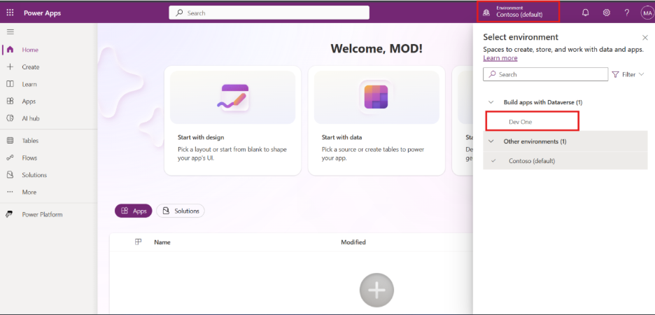

9.  The Power Apps Developer Plan is active, and the **Dev One**
    developer environment is selected for use in all subsequent
    exercises.

## Exercise 2: Create the Department Table from CSV

In this exercise, you will create the Department Dataverse table by
importing a CSV file. Power Apps reads the file, generates the columns
and sample records automatically, and no column is created by hand. This
table later becomes a knowledge source for the ZavaTalent agent, so
candidates can ask what a team actually does.

1.  From the left navigation in Power Apps, select **Tables**.

2.  On the command bar, click **New table**, then select **Create new
    tables**.

    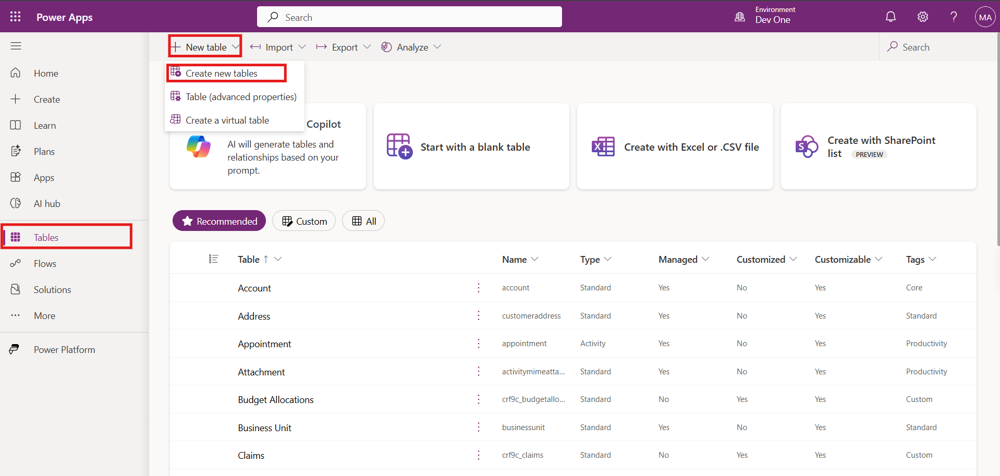

3.  On the **Choose an option to create tables** page, select **Import
    an Excel file or .CSV**.

    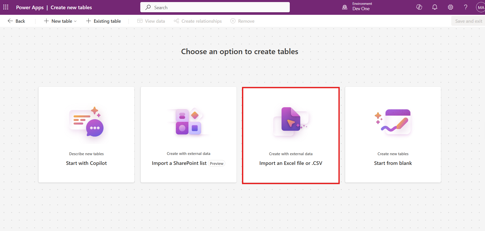

4.  In the **Import an Excel or .CSV file** dialog, click **Select from
    device**.

    

5.  Select **ZavaTalentHub_Departments.csv** from your **C:\\ Lab
    Files** folder, then click **Open**.

    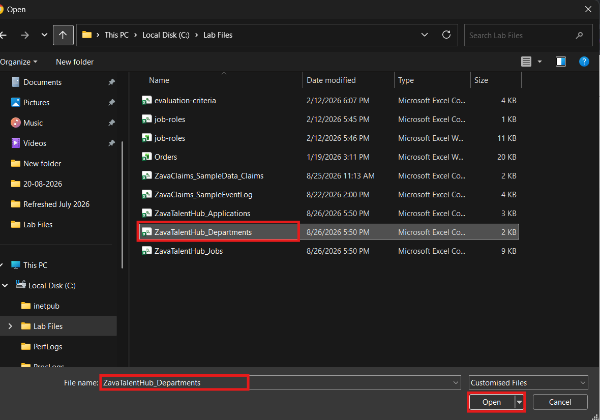

6.  Confirm the file is listed with **Include** turned on, then click
    **Import**.

    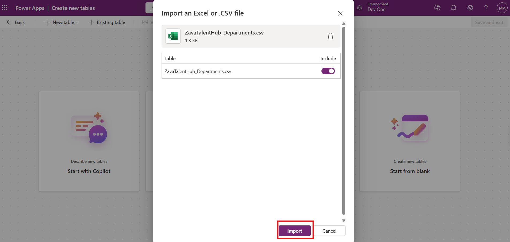

7.  Wait while Power Apps reads the file and generates the table. Click
    the table name on the card and rename it +++Department+++. Use the
    singular name — the Power Pages table picker in Exercise 6 and the
    Copilot Studio knowledge picker in Exercise 10 both list this table
    as **Department**.

    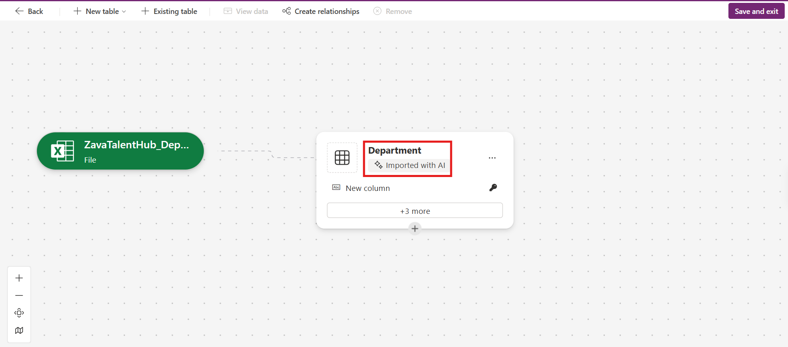

8.  On the table card, click the **More options (…)** icon, then select
    **View data**.

    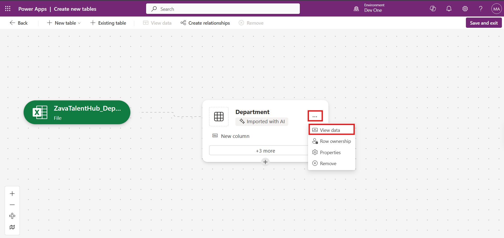

9.  In the data grid, click the **Department Name** column header, then
    select **Edit column**. Confirm the **Data type** is **Single line
    of text**.

    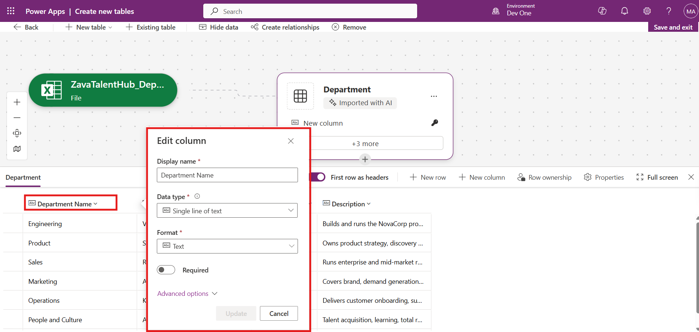

10. Click the **Department Head** column header and confirm the **Data
    type** is **Single line of text**.

    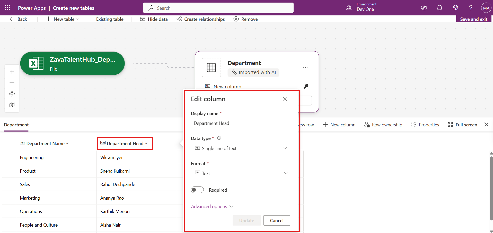

11. Click the **Team Size** column header, set the **Data type** to
    **Whole number**, then click **Update**.

    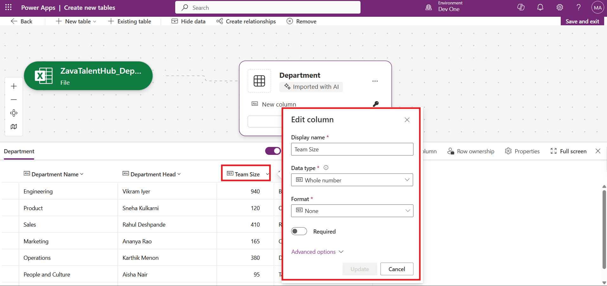

12. Click the **Description** column header, set the **Data type** to
    **Multiple lines of text**, then click **Update**.

    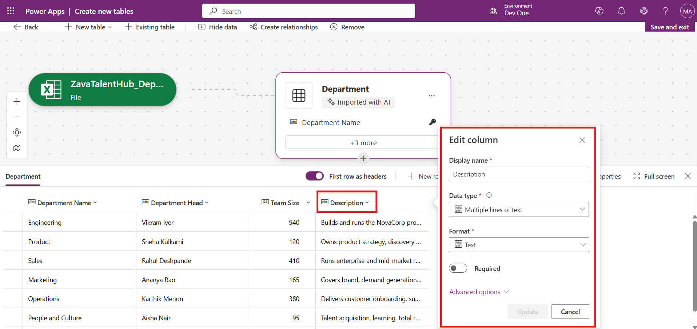

13. On the command bar, click **Save and exit**.

    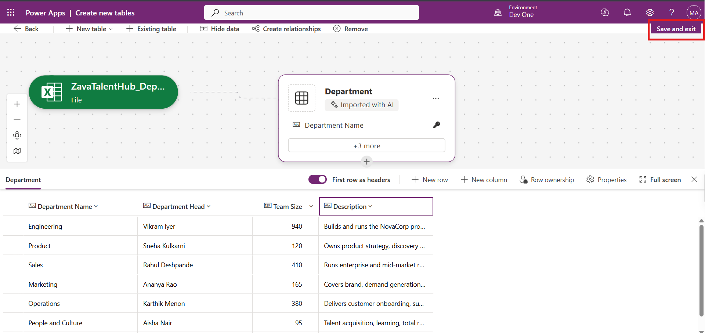

14. In the **Done working?** dialog, click **Save and exit**.

    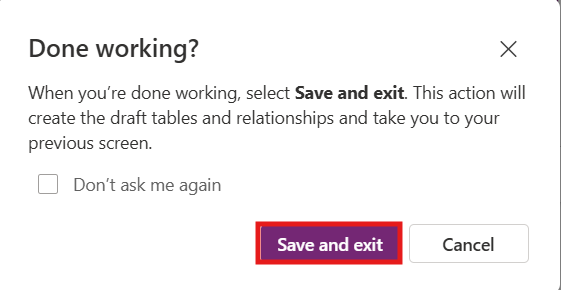

15. The Department table is created from CSV with all columns, data
    types, and the NovaCorp department records in place.

## Exercise 3: Create the Jobs Table from CSV

In this exercise, you will create the Jobs table using the same import
method. This is the most important table in the lab — the portal jobs
list reads from it, and the ZavaTalent agent answers candidate questions
from it. You will then add the job columns to the default view, because
that view is what the Power Pages list component displays.

**Import the Jobs Table**

1.  From the left navigation, select **Tables**.

2.  On the command bar, click **New table**, then select **Create new
    tables**.

    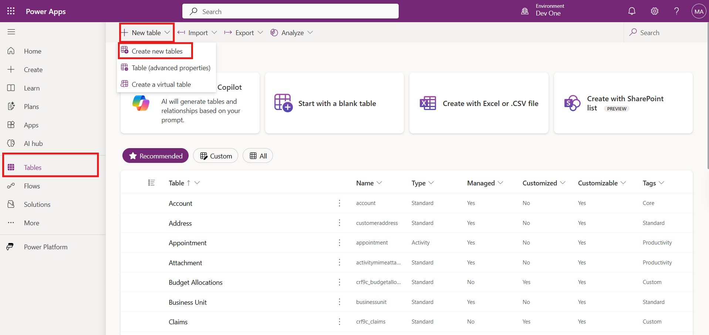

3.  On the **Choose an option to create tables** page, select **Import
    an Excel file or .CSV**.

    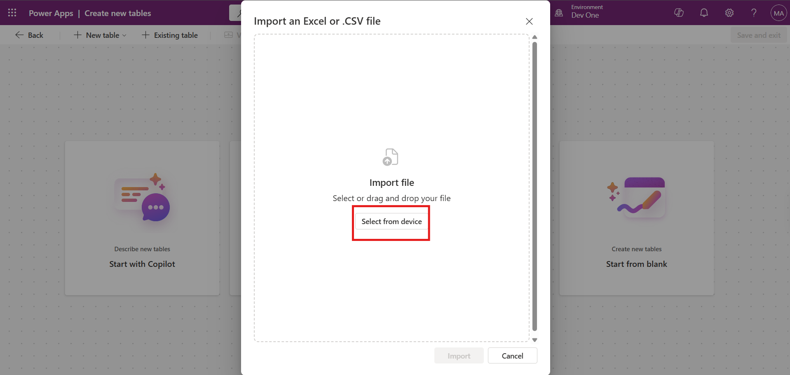

4.  In the dialog, click **Select from device**, select
    **ZavaTalentHub_Jobs.csv** from **C:\labfiles**, then click
    **Open**.

    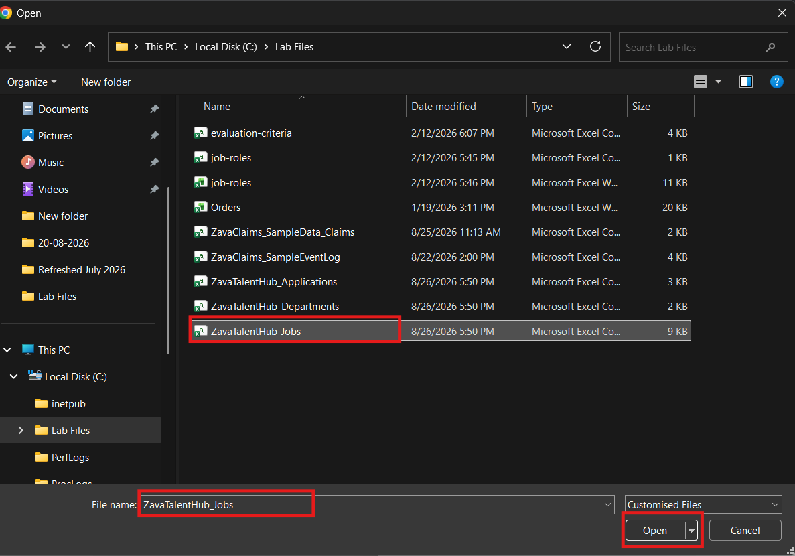

5.  Confirm the file is listed with **Include** turned on, then click
    **Import**.

    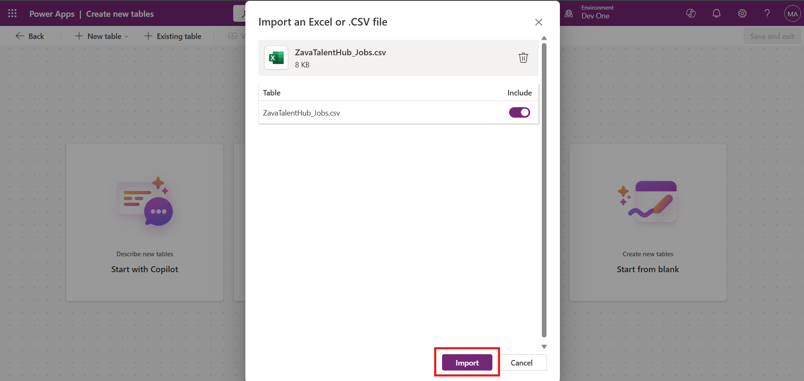

6.  Wait for the table to be generated. Click the table name on the card
    and rename it +++Jobs+++. The card shows **Job Reference** as the
    primary column and **+12 more**, confirming that all thirteen
    columns were read from the file.

    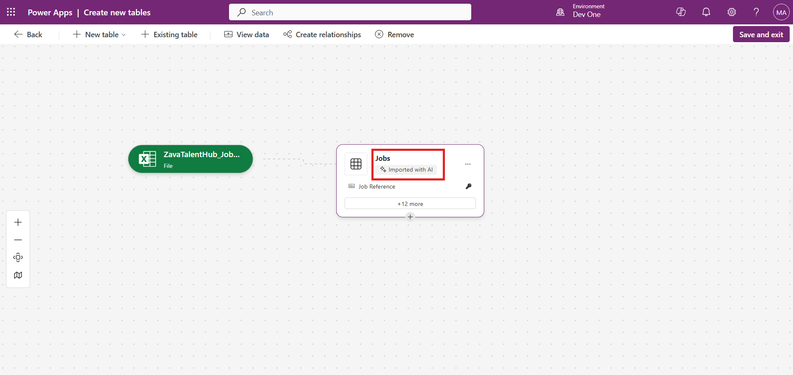

7.  On the table card, click the **More options (…)** icon, then select
    **View data**.

8.  Confirm or set the data type of each column as listed below. Click a
    column header, select **Edit column**, set the type, then click
    **Update**.

    1.  **Job Reference** — Single line of text

    2.  **Job Title** — Single line of text

    3.  **Department** — Single line of text

    4.  **Location** — Single line of text

    5.  **Employment Type** — Single line of text

    6.  **Experience Level** — Single line of text.

    7.  **Salary Range** — Single line of text

    8.  **Job Description** — Multiple lines of text

    9.  **Key Responsibilities** — Multiple lines of text

    10. **Required Skills** — Multiple lines of text.

    11. **Posted Date** — Date and time, with the **Format** set to
        **Date only.**

    12. **Application Deadline** — Date and time, with the **Format**
        set to **Date only**

    13. **Is Active** — Single line of text.

9.  Employment Type, Experience Level, and Is Active must remain
    **Single line of text** and must not be converted to choice or
    Yes/No columns. The portal filters and the agent both read these
    values as text, and a choice column would require additional
    configuration that this lab deliberately avoids.

    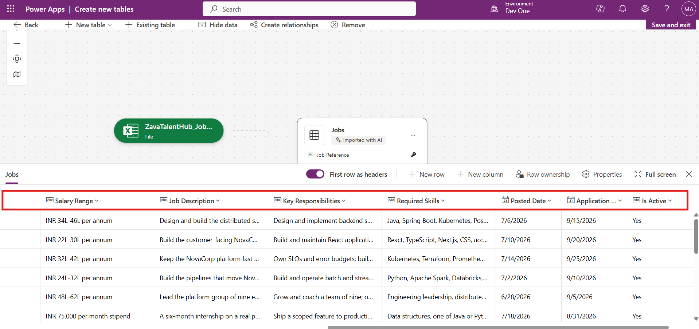

10. On the command bar, click **Save and exit**.

    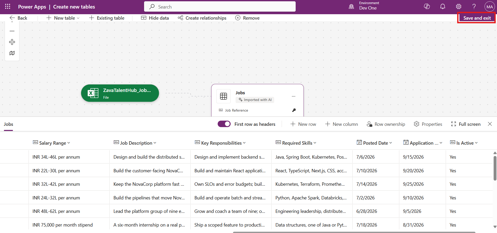

11. In the **Done working?** dialog, click **Save and exit**.

    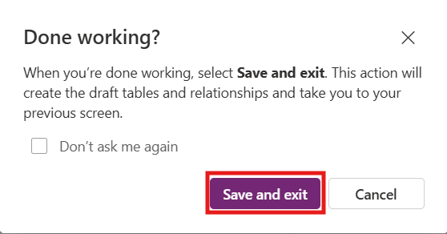

**Add the Job Columns to the Active Jobs View**

The Power Pages list component displays whatever columns the selected
Dataverse view contains. By default, the Active Jobs view shows only a
few columns, so you will add the remaining job columns now. If you skip
this, the Open Roles page in Exercise 7 shows an almost empty table.

1.  From the left navigation, select **Tables**, then click the **Jobs**
    table to open it.

    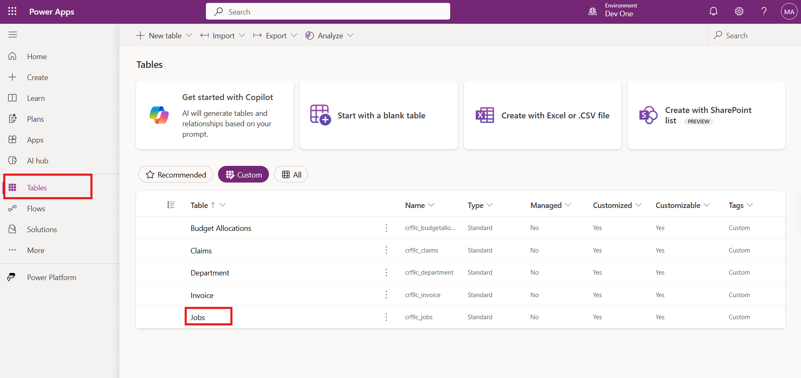

2.  On the Jobs table page, locate the **Data experiences** card, then
    select **Views**.

    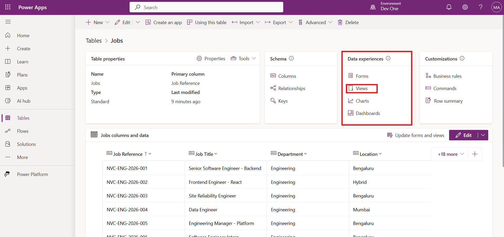

3.  In the list of views, click **Active Jobs**. This is the **Public
    View** marked as **default**, and it is the view the portal list
    will use.

    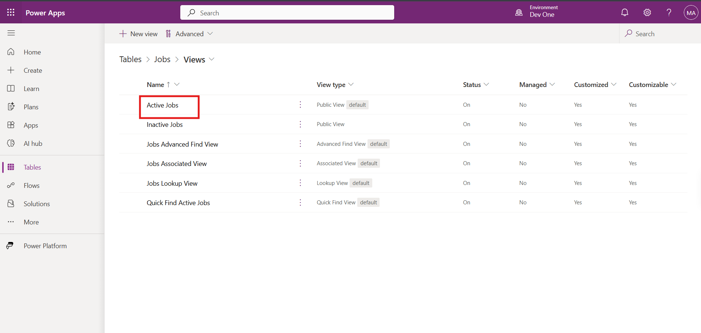

4.  The view designer opens. In the **Table columns** panel on the left,
    confirm the **Jobs** tab is selected, then click each of the
    following columns to add it to the view. Each column you click is
    appended to the right-hand end of the grid.

    1.  Job Title

    2.  Department

    3.  Location

    4.  Employment Type

    5.  Experience Level

    6.  Salary Range

    7.  Job Description

    8.  Key Responsibilities

    9.  Required Skills

    10. Posted Date

    11. Application Deadline

    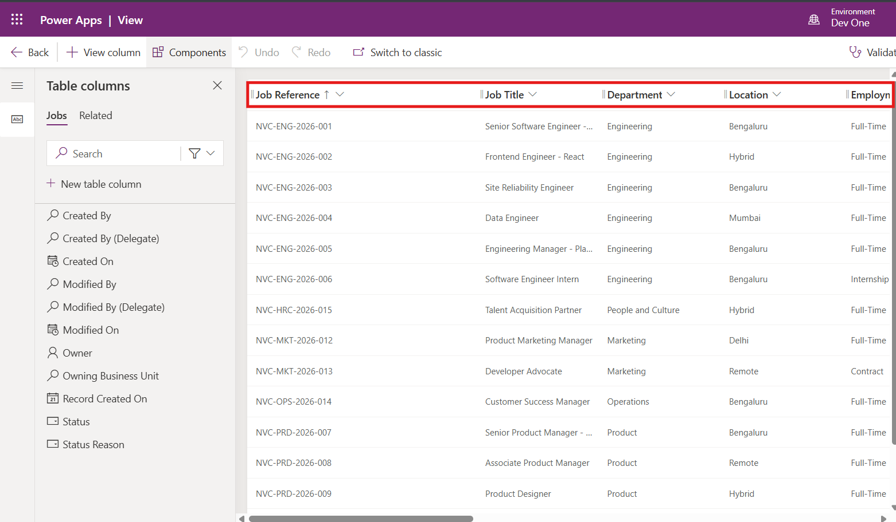

5.  Drag the **Job Title** column to the first position so that
    candidates see the role name before the reference code. Confirm the
    **Sort by** panel on the right still shows **Job Reference** and
    that **Filter by** shows **Status is 'Active'**.

6.  On the command bar, click **Save and publish**.

    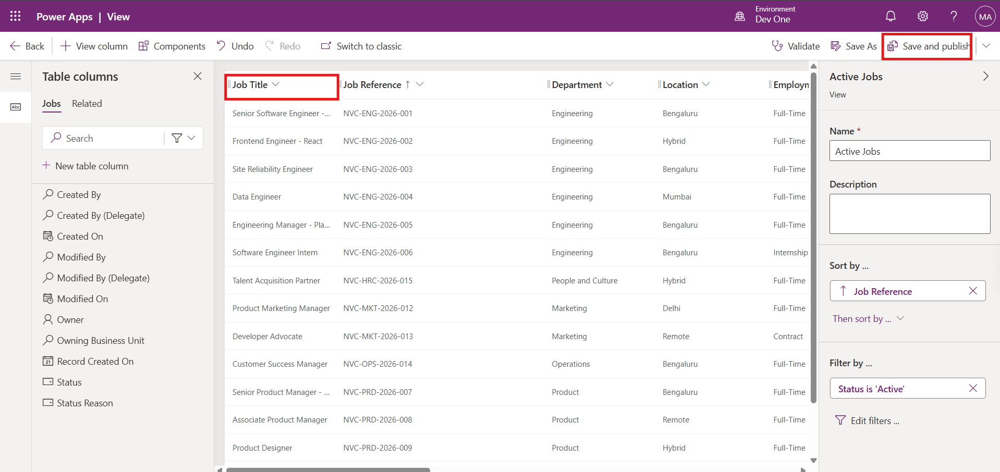

7.  The Jobs table is created, and the Active Jobs view carries every
    column the portal list needs to display.

## Exercise 4: Create the Applications Table from CSV

In this exercise, you will create the Applications table. This table
receives every application submitted through the portal form you build
in Exercise 8.

1.  From the left navigation, select **Tables**.

2.  On the command bar, click **New table**, then select **Create new
    tables**.

    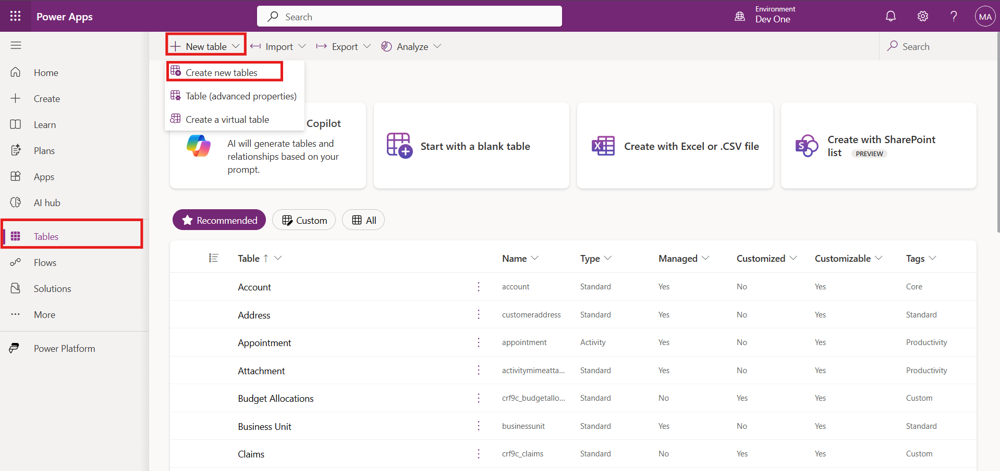

3.  On the **Choose an option to create tables** page, select **Import
    an Excel file or .CSV**.

    

4.  In the dialog, click **Select from device**.

    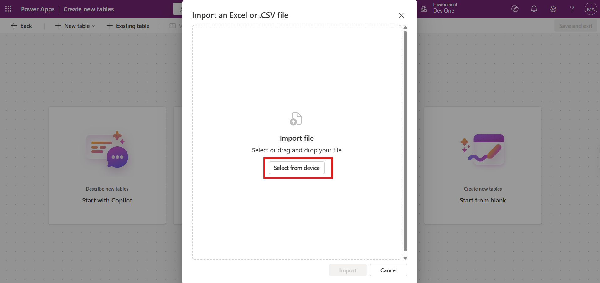

5.  Select **ZavaTalentHub_Applications.csv** from **C:\Lab Files**,
    then click **Open**.

    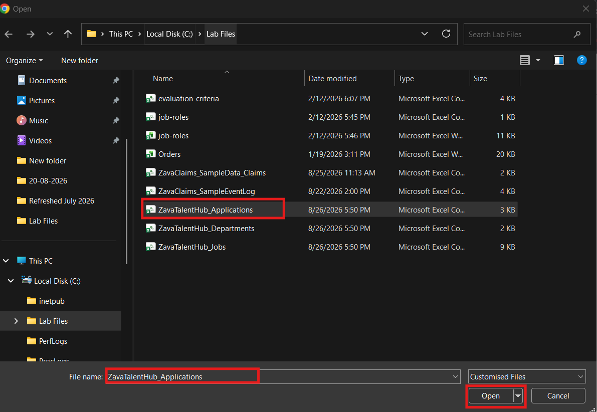

6.  Confirm the file is listed with **Include** turned on, then click
    **Import**.

    

7.  Wait for the table to be generated. Click the table name on the card
    and rename it +++Applications+++

    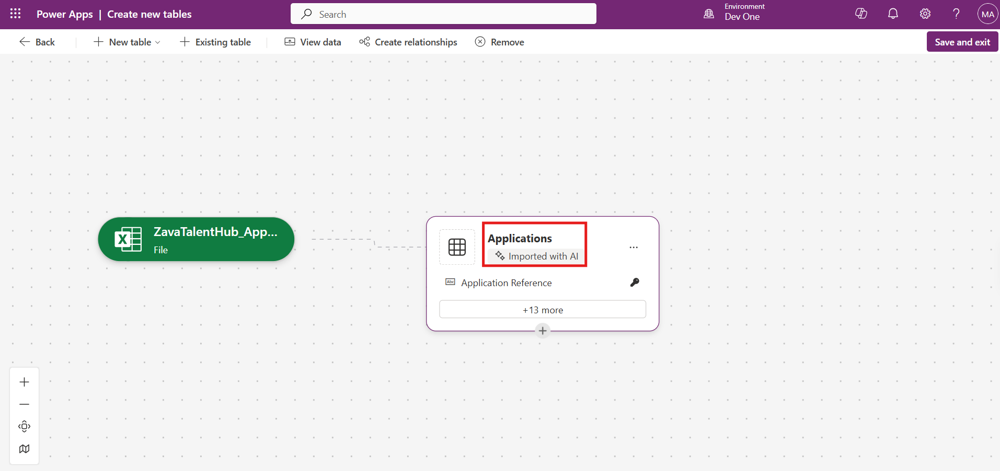

8.  On the table card, click the **More options (…)** icon, then select
    **View data**.

    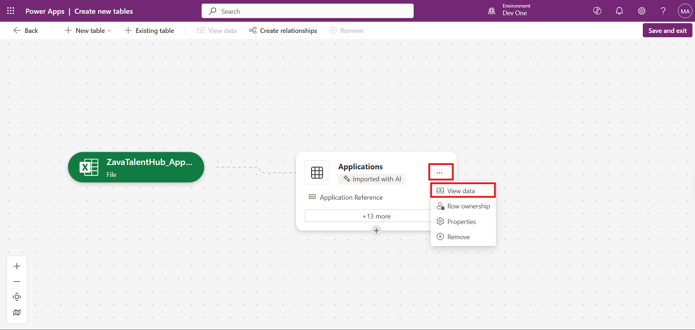

9.  Confirm or set the data type of each column as listed below. Click a
    column header, select **Edit column**, set the type, then click
    **Update**.

    1.  **Application Reference** — Single line of text

    2.  **Applicant Name** — Single line of text

    3.  **Email Address** — Single line of text, with the **Format** set
        to **Email**

    4.  **Phone Number** — Single line of text

    5.  **Job Reference** — Single line of text

    6.  **Job Applied For** — Single line of text.

    7.  **Total Experience** — Whole number

    8.  **Current Company** — Single line of text

    9.  **Current Role** — Single line of text

    10. **LinkedIn Profile URL** — Single line of text

    11. **Skills Summary** — Multiple lines of text

    12. **Cover Letter** — Multiple lines of text.

    13. **Application Status** — Single line of text

    14. **Submitted Date** — Date and time, with the **Format** set to
        **Date only.**

    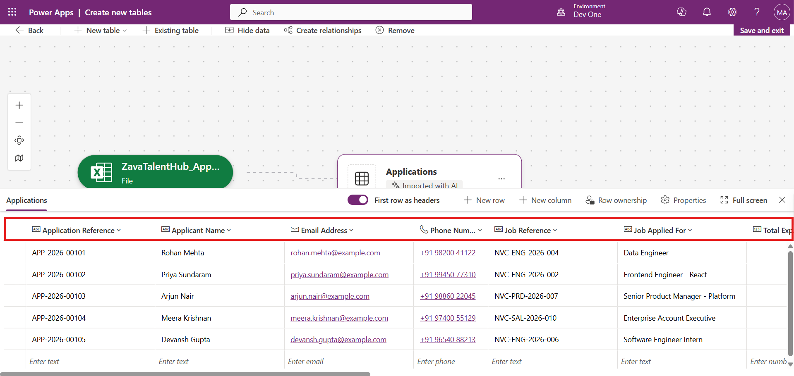

10. **Application Status** must remain **Single line of text** so that a
    recruiter or a downstream flow can write a status value such as
    Received directly, without choice-column configuration.

11. On the command bar, click **Save and exit**.

    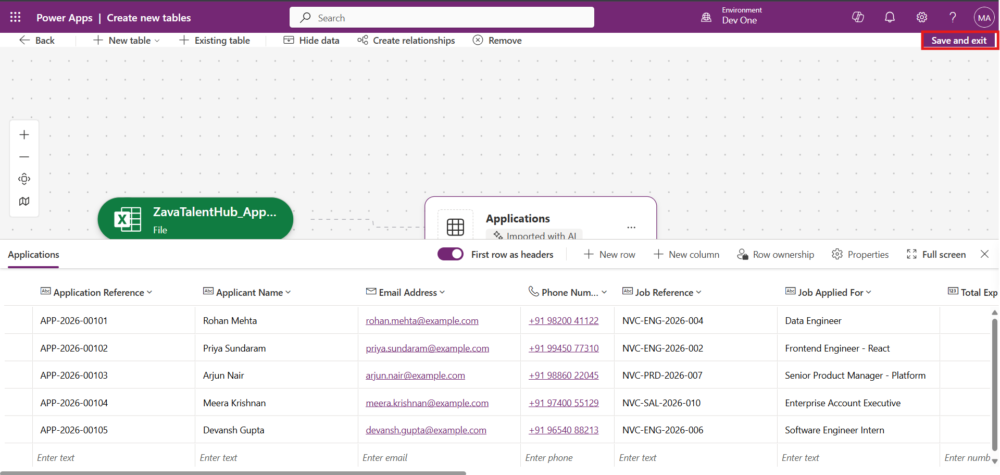

12. In the **Done working?** dialog, click **Save and exit**.

    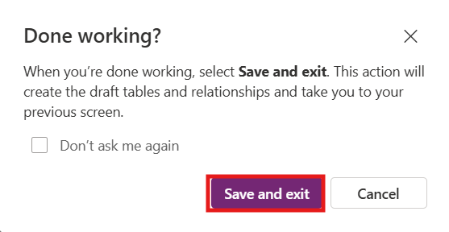

13. All three Dataverse tables are now created from CSV, and the data
    layer of Zava TalentHub is complete.

## Exercise 5: Activate the Power Pages Trial and Generate the Site with Copilot

In this exercise, you will activate the Power Pages trial and generate
the complete Zava TalentHub portal from a single natural language
description. Copilot creates the pages, navigation, layout, sections,
and theme in under a minute — work that would otherwise take an
afternoon of manual page building.

1.  Open a new browser tab and navigate to
    +++https://make.powerpages.microsoft.com+++ the Power Pages home
    page.

    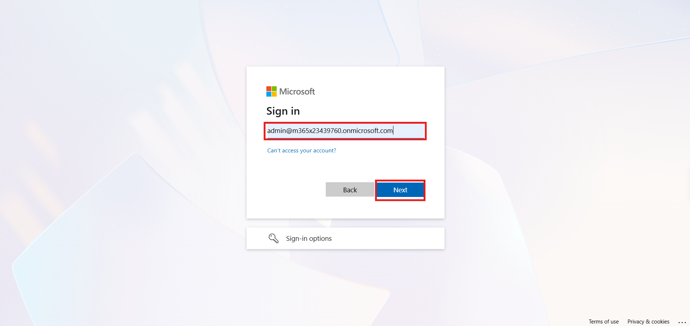

2.  If prompted, sign in with the same lab admin account used in
    Exercise 1.

    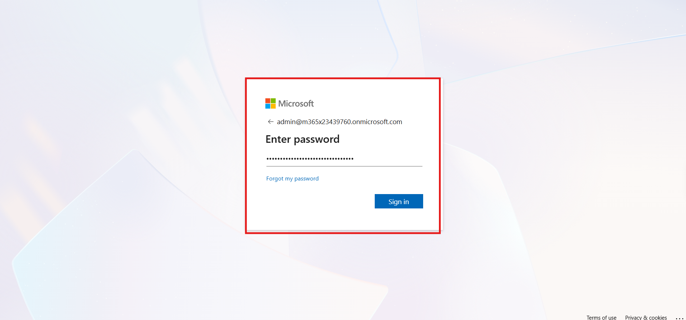

3.  Confirm the environment selector in the top-right corner shows **Dev
    One**. If it does not, click it and select **Dev One**. The site
    must be created in the same environment as your Dataverse tables.

    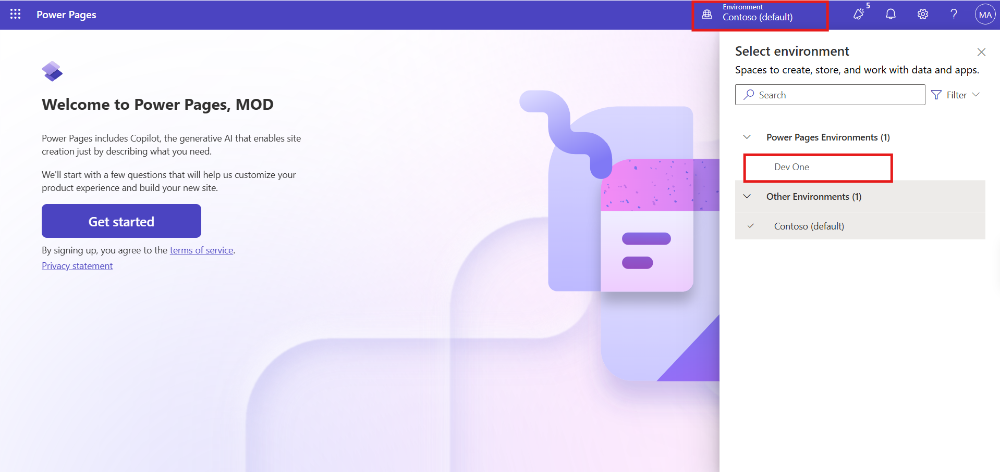

4.  Wait while the Power Pages trial is provisioned for the **Dev One**
    environment.

    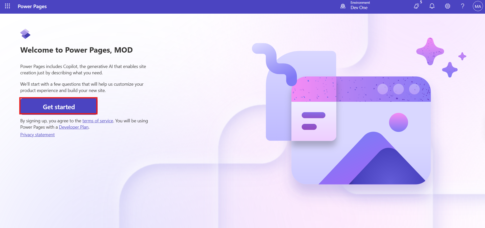

5.  On the **Tell us a little about yourself** page, click **Skip** in
    the bottom-right corner. The industry selection has no effect on the
    portal you are about to build.

    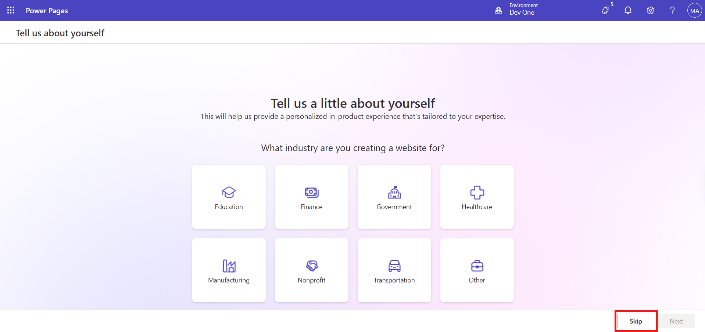

6.  On the **Start building your website with Copilot** page, click into
    the description box, enter the following text, then click the
    **Send** arrow at the right of the box:

    1.  +++Careers portal "Zava TalentHub" for NovaCorp. Navigation:
        Home, Open Roles, Life at NovaCorp, Apply Now, Contact
        Recruitment. Open Roles and Apply Now: empty sections only. Navy
        \#1B3C6E, indigo \#4F46E5. +++

    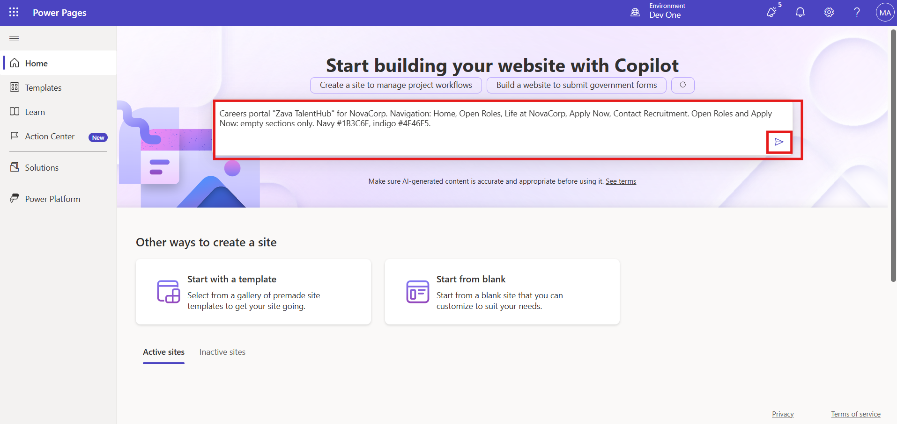

7.  On **Step 1 of 3: Site details**, confirm the values below, then
    click **Next**.

    1.  **Give your site a name** — +++Zava TalentHub+++

    2.  **Create a web address** — accept the generated address, for
        example zavatalenthub-f3ef. Yours will end in different
        characters, which is expected.

    3.  **Site language** — English (United States)

    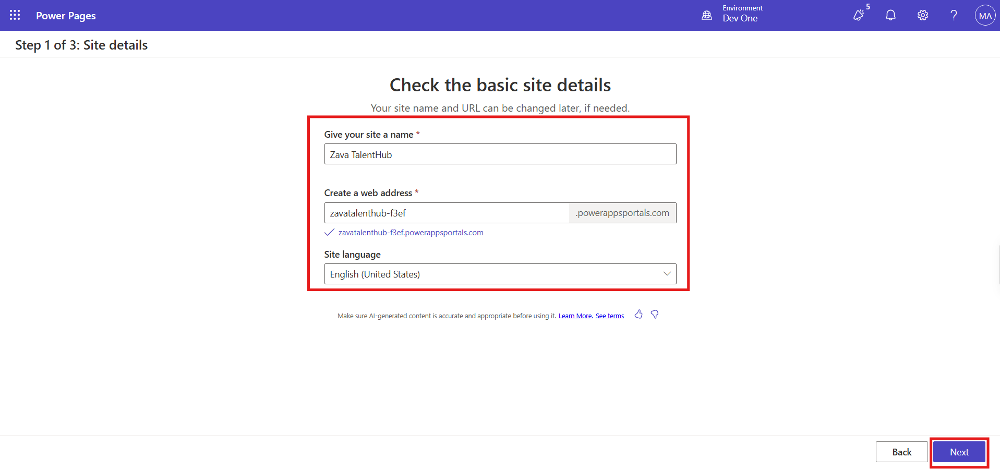

8.  On **Step 2 of 3: Choose a layout**, review the generated home page
    preview. If the navy header and hero section look correct, click
    **Next**. To generate a different layout, click **Try again** first.

    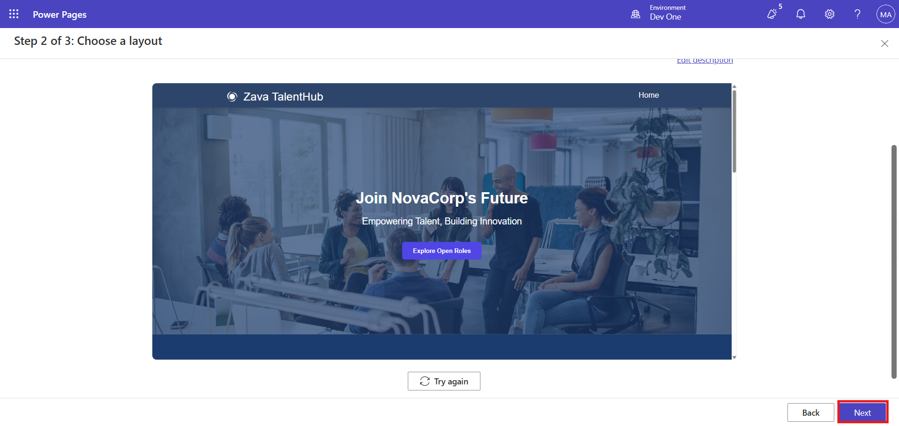

9.  On **Step 3 of 3: Add common pages**, confirm the check mark is
    selected on all six page cards — **Open Roles**, **Life at
    NovaCorp**, **Apply Now**, **Contact Recruitment**, **About Us**,
    and **FAQ** — then click **Done**.

    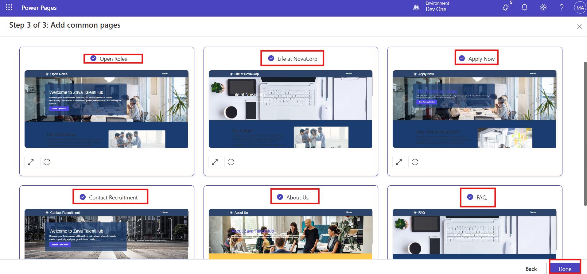

10. Wait while Copilot generates the site and opens the **Design
    Studio**. In the **Pages** workspace, confirm that **Main
    navigation** lists Home, Open Roles, Life at NovaCorp, Apply Now,
    Contact Recruitment, About Us, and FAQ.

    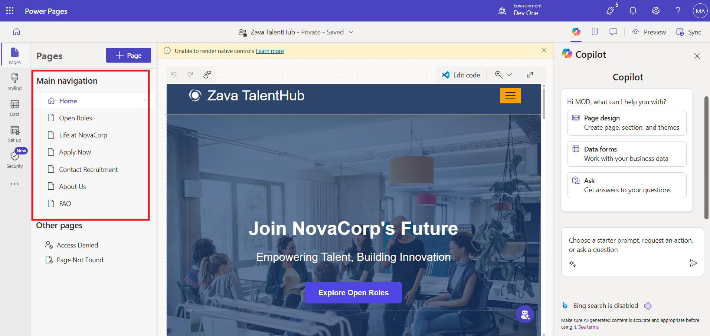

11. Keep this Design Studio browser tab open. You return to it in
    Exercises 6, 7, 8, 11, and 12.

12. The Zava TalentHub site is generated with its navigation, layout,
    and theme in place, and the Design Studio is open and ready for
    editing.

## Exercise 6: Configure Table Permissions for Portal Visitors

In this exercise, you will grant portal visitors permission to read the
Jobs and Department tables and to create rows in the Applications table.
This step comes before building the pages for a reason: without table
permissions, a Dataverse list shows no rows and a form fails to save,
and that empty page is the single most common problem in a Power Pages
build.

1.  In **Design Studio**, select the **Security** workspace from the
    left navigation.

2.  Under **Protect**, select **Table permissions**.

    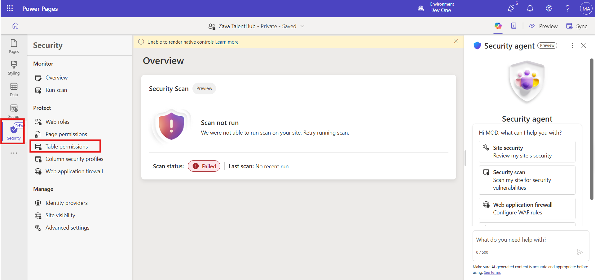

**Permission 1 — Jobs, public read**

1.  Click **+ New permission**.

    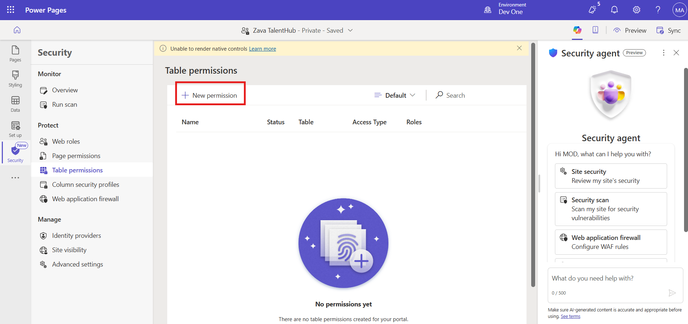

2.  In the **Name** field, enter +++Jobs public read+++

3.  In the **Table** field, select **Jobs**.

4.  Set **Access type** to **Global access**.

5.  Under **Permission to**, select **Read** only. Leave Update, Create,
    Delete, Append, and Append to cleared.

6.  Under **Roles**, click **+ Add roles**, select both **Anonymous
    Users** and **Authenticated Users** in the **Roles** flyout, then
    close the flyout.

7.  Click **Save**.

    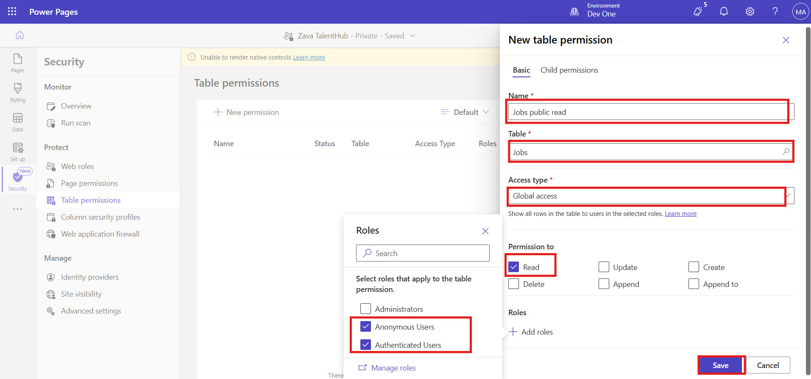

8.  In **The data displayed in your site can be seen by anyone** dialog,
    click **Save**. This dialog appears every time a permission grants
    the Anonymous Users role, and it must be accepted for the permission
    to be written.

    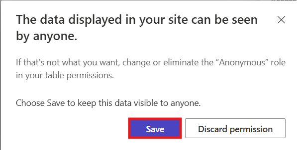

**Permission 2 — Department, public read**

1.  Click **+ New permission**.

    

2.  In the **Name** field, enter +++Departments public read+++

3.  Set **Table** to **Department**, **Access type** to **Global
    access**, and **Permission to** **Read** only. The Table field lists
    the singular display name, **Department**, not Departments.

4.  Under **Roles**, click **+ Add roles**, select both **Anonymous
    Users** and **Authenticated Users**, then click **Save**.

    

5.  In the **The data displayed in your site can be seen by anyone**
    dialog, click **Save**.

    

**Permission 3 — Applications, public create**

1.  Click **+ New permission**.

2.  In the **Name** field, enter +++Applications public create+++ Check
    the field after pasting and remove any stray + character left behind
    by the copy control, because the permission name is saved exactly as
    typed.

3.  Set **Table** to **Applications** and **Access type** to **Global
    access**.

4.  Under **Permission to**, select **Create** and **Update**. The
    dialog offers Read, Update, Create, Delete, Append, and Append to —
    there is no option labelled Write; **Update** is the equivalent. Do
    not select **Read**.

5.  Under **Roles**, click **+ Add roles**, select both **Anonymous
    Users** and **Authenticated Users**, then click **Save**.

    

6.  In **The data displayed in your site can be seen by anyone** dialog,
    click **Save**.

    

1.  Read is deliberately withheld on Applications. Candidates must be
    able to submit an application, but no anonymous visitor should be
    able to read anyone else's submitted application from the portal.

2.  The three table permissions are saved, and portal visitors can now
    read live job and department data and submit an application.

## Exercise 7: Build the Open Roles Page with a Live Jobs List

In this exercise, you will connect the Open Roles page to the Jobs table
so that candidates browse live Dataverse data. Every role added to the
Jobs table from now on appears on the portal automatically, with no page
edit required.

1.  In **Design Studio**, select the **Pages** workspace.

2.  Select the **Open Roles** page to open it on the canvas.

    

3.  If the page contains placeholder text generated by Copilot, click it
    and delete it so the page is empty below the heading.

    

4.  Confirm the section below the heading is now empty and ready for the
    list component.

    

5.  Click the **+** icon on the canvas to add a component, then select
    **List** from the component panel.

6.  In the **Add a list** dialog, set the following, then click
    **Done**:

    1.  **Choose a table** — select **Jobs**

    2.  **Select the data views** — select **Active Jobs**

    3.  **Name your list** — enter +++Open Roles List+++

    

7.  The list appears on the canvas showing placeholder rows. With the
    list selected, open **List settings**, then select **More options**
    under **Actions** in the left rail.

8.  Set **Number of records per page** to +++10+++

9.  Turn on **Enable search in this list**, enter the following
    **Placeholder text**, then click **Done**: +++Search roles by title,
    team, or location+++

    

10. Click **Sync** on the command bar to save the changes to the portal.

    

11. Click **Preview** and select **Desktop**.

    

12. In the preview, type +++Engineering+++ into the search box and
    confirm the list filters to the Engineering roles only.

    

13. If the list renders but shows no rows, the Jobs table permission
    from Exercise 6 has not been saved or has not been assigned to
    Anonymous Users. If the list shows rows but only one or two columns,
    the Active Jobs view columns from Exercise 3 were not saved and
    published.

14. The Open Roles page displays live, searchable job data from
    Dataverse.

## Exercise 8: Build the Apply Now Page with the Application Form

In this exercise, you will add a Dataverse form to the Apply Now page so
candidates can submit an application directly into the Applications
table. This turns the portal from a brochure into a working recruitment
system.

1.  In **Design Studio**, select the **Pages** workspace, then select
    the **Apply Now** page.

2.  Hover below the hero section and click **+ ADD A SECTION**, then
    choose the **1 Column** layout.

    

3.  In the new empty section, the **Choose a component to add to this
    section** panel appears. Select **Form**.

    

4.  The **Describe a form to create it** panel opens. Ignore the AI
    description box and the suggested prompts. Under **Other ways to get
    started**, click **+ New form**.

    

5.  In the **Add a form** dialog, on the **Form** tab, set the
    following, then click **OK**:

    1.  **Choose a table** — select **Applications**

    2.  **Select a form** — select **Information**

    3.  **Name your copy of the selected form** — enter +++TalentHub
        Application+++

    

6.  The form is added to the canvas showing every column from the
    Applications table. On the form toolbar, click **Edit fields** to
    open the Dataverse form designer.

    

7.  Three fields must be removed, because the system generates them
    rather than the candidate. In the form designer, click the
    **Application Reference** field to select it, then click **Delete**
    on the command bar.

    

8.  Scroll to the bottom of the form. Select the **Application Status**
    field and click **Delete**, then select the **Submitted Date** field
    and click **Delete**.

    

9.  Application Status and Submitted Date are set after submission by a
    recruiter or a downstream flow, and Application Reference is
    system-generated. Leaving them on the public form would let a
    candidate set their own application status.

10. Confirm the last field on the form is now **Cover Letter**, then
    click **Save and publish** on the command bar.

    

11. Wait for the publish to complete, then click **Back** to return to
    the Design Studio canvas.

    

12. On the canvas, confirm the form now starts at **Applicant Name**. On
    the form toolbar, click **Edit form** to reopen the form settings
    dialog.

    

13. In the **Add a form** dialog, select the **On submit** tab on the
    left, then set the following and click **OK**:

    1.  **When the form is submitted** — select **Display a message**

    2.  **Display this message** — enter +++Thank you for applying to
        NovaCorp. Your application has been received and you will get a
        confirmation email shortly. Our Talent Acquisition team reviews
        every application within 3 to 5 business days.+++

    3.  Select the **Hide form when submitted** check box

    

14. Click **Sync** on the command bar to save the Apply Now page to the
    portal.

    

15. The Apply Now page carries a working application form that writes
    directly into the Applications table.

## Exercise 9: Activate the Copilot Studio Trial and Create the ZavaTalent Agent

In this exercise, you will activate Copilot Studio in the same Dev One
environment and create the ZavaTalent agent — the assistant that answers
candidate questions on the portal at any hour, without a recruiter being
involved.

**Activate the Copilot Studio Trial**

1.  Open a new browser tab and navigate to
    +++https://www.microsoft.com/en-us/microsoft-365-copilot/microsoft-copilot-studio+++
    the Microsoft Copilot Studio product page.

2.  Click **Sign in to Copilot Studio**.

    

3.  Enter the M365 admin tenant ID in the **Sign in** field, then click
    **Next**.

    

4.  Enter the password in the **Enter password** field, then click
    **Sign in**.

    

5.  When prompted with **Stay signed in?**, click **Yes**.

    

6.  Wait while Copilot Studio loads. The address bar shows that the
    portal has opened in the **Default** environment.

    

    > Note: If Copilot studio navigate to new Copilot Studio portal, Turn off the new exeperience button.

      

      

7.  If Copilot Studio does not load in **Dev One**, open a new browser
    tab and navigate to +++https://admin.powerplatform.microsoft.com+++
    the Power Platform admin centre.

8.  From the left navigation, select **Manage**, then select
    **Environments**, then select **Dev One**.

    

9.  On the **Dev One** details page, copy the **Environment ID** value.

    

10. Return to the Copilot Studio tab, replace the environment identifier
    in the address bar with the copied **Environment ID**, then press
    **Enter**.

    

11. On the **Select a team** dialog, click **start a trial**.

    

12. Under **Let's get you started**, click **Continue**.

    

13. On the setup screen, provide the required information, then click
    **Get Started**:

    1.  Select your **Country or Region** from the dropdown list

    2.  Enter your **Job title** to indicate your role

    3.  Enter a **Company name**

    4.  Enter a valid **Business phone number**

    

14. On the **Confirmation details** step, click **Get Started**.

    

15. Confirm the Copilot Studio home page loads and that the environment
    selector shows **Dev One**.

    

16. The Copilot Studio trial is active and running in the same Dev One
    environment that holds the Dataverse tables.

**Create the ZavaTalent Agent**

1.  From the left navigation, select **Agents**.

2.  In the top-right corner, click **+ Create blank agent**. Do not use
    the description box — you supply the instructions yourself in a
    moment.

    

3.  In the **Name your agent** dialog, enter +++ZavaTalent+++ then click
    **Create**.

    

4.  Wait for the message **Your agent has been provisioned**. On the
    **Details** card, click **Edit**.

    

5.  Click into the **Description** field, enter the following text, then
    click **Save** on the Details card:

    1.  +++Helps NovaCorp job candidates on the Zava TalentHub portal
        with information about open roles, application guidance, the
        interview process, and NovaCorp culture and benefits, using live
        Dataverse job data.+++

    

6.  Scroll down to the **Instructions** card and click **Edit**.

    

7.  Enter the following instructions in full, then click **Save** on the
    Instructions card. These instructions are what keep the agent
    grounded in the Jobs and Department data rather than inventing
    roles.

    1.  +++You are ZavaTalent, the careers assistant for the NovaCorp
        Zava TalentHub portal. Help candidates find roles that match
        their skills, understand what a role involves, and navigate the
        application and interview process. Response format rules: when
        describing a role, always return Job Title, Department,
        Location, Employment Type, Experience Level, Salary Range, and
        Application Deadline. When several roles match, return a
        formatted table and lead with the closest match. Format salary
        values exactly as they appear in the data. Behaviour rules: only
        answer from Zava TalentHub job and department data and never
        invent a role, salary, deadline, or requirement. If no role
        matches, say so and suggest the closest department. Ask about
        skills and experience level before recommending roles. Never
        guarantee an interview or predict a hiring decision. If asked
        about salary negotiation, say that compensation is discussed at
        the offer stage with the Talent Acquisition team. Be encouraging
        and professional, and keep responses under 180 words unless a
        table is clearer. If you cannot help, tell the candidate to
        email careers@novacorp.com.+++

    

**Allow Anonymous Access to the Agent**

The portal is public, so candidates will use the agent without signing
in. By default a new agent requires authentication, which would show an
error in the chat window for every anonymous visitor.

1.  In the top-right corner, click **Settings**.

    

2.  In the Settings panel, select **Security** from the left list, then
    select **Authentication**.

    

3.  Under **Choose an option**, select **No authentication**, then click
    **Save**.

    

4.  In the **Save this configuration?** dialog, read the warning and
    click **Save**.

    

5.  Confirm the message **Authentication settings saved**, then click
    the **X** in the top-right corner to close the Settings panel.

    

6.  The ZavaTalent agent is created, configured with its response format
    and behaviour rules, and reachable by anonymous portal visitors.

## Exercise 10: Add the Knowledge Sources and Set the Welcome Message

In this exercise, you will connect the Jobs and Department tables to the
agent as Dataverse knowledge sources, set a welcome message that tells
candidates what the agent can do, and test it. No topic is authored —
the agent answers from live data.

**Add the Dataverse Knowledge Sources**

1.  On the agent page, select the **Knowledge** tab from the top
    navigation.

2.  Click **+ Add knowledge**.

    

3.  In the **Add knowledge** panel, under the **Featured** tab, select
    **Dataverse**.

    

4.  In the **Dataverse knowledge source** panel, type +++Department+++
    into the search box, select the check box next to the **Department**
    table (schema name crf9c_department), then click **Add to agent**.
    The table is listed under **Suggested** — the **Search results for
    'Department'** section below reads No results found, which is
    expected and can be ignored.

    

5.  Confirm the **Department** table now appears in the knowledge list,
    then click **+ Add knowledge** again to add the second table.

    

6.  In the **Add knowledge** panel, select **Dataverse** again.

    

7.  Type +++Jobs+++ into the search box, select the check box next to
    the **Jobs** table (schema name crf9c_Jobs), then click **Add to
    agent**.

    

8.  Confirm the knowledge list now shows both **Jobs** and
    **Department**, each with the type **Dataverse** and available to
    **ZavaTalent**.

    

9.  The **Status** column may read Unavailable or show a spinner for a
    minute or two while Dataverse indexes the tables. Wait until both
    rows are ready before testing the agent, otherwise the agent answers
    that it has no information about NovaCorp roles.

**Set the Welcome Message**

1.  Select the **Topics** tab from the top navigation.

2.  Select the **System** filter, then click the **Conversation Start**
    topic to open it.

    

3.  On the authoring canvas, click into the **Message** node text box,
    select the existing default text, replace it with the following,
    then click **Save** in the top-right corner:

    1.  +++Hi! I am ZavaTalent, your NovaCorp career guide. I can help
        you find roles that match your skills, explain what a specific
        role involves, describe our teams and benefits, and walk you
        through the application and interview process. What kind of role
        are you looking for?+++

    

4.  Return to the **Overview** tab and click **Publish** in the
    top-right corner.

    

5.  In the **Publish this agent** dialog, leave **Force newest version**
    cleared and click **Publish**. Wait for the publish to complete.

    

**Test the Agent**

1.  In the top-right corner, click **Test** to open the test panel.

2.  Enter the following query and click the **Send** icon: +++What
    engineering roles are open in Bengaluru?+++

    

3.  Confirm the agent returns the Bengaluru engineering roles from the
    Jobs table with title, location, and salary range, and cites the
    Jobs table as its source.

    

4.  Enter the following query and click the **Send** icon: +++I have
    four years of React and TypeScript experience. Which role suits
    me?+++

    

5.  Confirm the agent recommends the **Frontend Engineer - React** role
    and explains why.

    

6.  Enter the following query and click the **Send** icon: +++Tell me
    about the Product team at NovaCorp+++

    

7.  Confirm the agent answers from the Department table, naming the
    department head and team size.

    

8.  Enter the following query and click the **Send** icon: +++Do you
    have any roles for a marine biologist?+++

    

9.  Confirm the agent says no matching role is open rather than
    inventing one. This is the grounding rule from your instructions
    working as designed.

    

10. The ZavaTalent agent answers candidate questions accurately from
    live Dataverse data and refuses to invent roles that do not exist.

## Exercise 11: Embed the ZavaTalent Agent in the Portal

In this exercise, you will add the published agent to Zava TalentHub so
that a chat button appears on every page and candidates can ask
questions without leaving the portal.

1.  Return to the **Power Pages Design Studio** tab.

2.  Select the **Set up** workspace from the left navigation.

3.  Under **AI assistance**, select **Agents**, then click **+ Add
    agent** on the **Agents in this site** card.

    

4.  In the **Add agent** dialog, select the radio button next to
    **ZavaTalent**, then click **Continue**. Take care to select
    ZavaTalent and not one of the similarly named sample agents in the
    environment.

    

5.  In the **Edit agent** panel, confirm **Show in Chat Widget** is
    turned on. Under **Roles**, click **+ Add roles**, select both
    **Anonymous Users** and **Authenticated Users**, then click
    **Save**.

    

6.  If the **Save agent without roles?** dialog appears, the roles have
    not registered. Click **Save** to continue, then reopen **Edit
    agent** and add the roles again.

    

7.  On the **Agents in this site** list, click the **More options (⋮)**
    icon on the **ZavaTalent** row, then select **Publish**.

    

8.  Confirm the message **The Agent 'ZavaTalent' is saved!**, then click
    **Sync** on the command bar.

    

9.  The ZavaTalent agent is embedded in Zava TalentHub and available to
    anonymous visitors on every page.

## Exercise 12: Publish and Test Zava TalentHub End to End

In this exercise, you will publish the portal to the public internet and
walk the candidate journey exactly as a NovaCorp applicant would
experience it — browsing roles, searching the live jobs list, and asking
the agent for a recommendation.

1.  Return to the **Power Pages Design Studio** tab.

2.  Click **Preview** on the command bar, then select **Desktop** to
    open the live site in a new tab.

    

3.  On the Zava TalentHub home page, confirm the navy header, the
    branded navigation, and the hero section render correctly. In the
    navigation, click **Open Roles**.

    

4.  On the **Open Roles** page, confirm the jobs list shows the live
    Jobs data with **Job Title** as the first column. Type +++Remote+++
    into the search box and confirm the list filters to the remote roles
    only.

    

5.  Return to the **Home** page and locate the **ZavaTalent** chat
    button in the bottom-right corner of the page. Click it to open the
    chat window.

    

6.  Confirm the welcome message you configured in Exercise 10 appears.
    Enter the following question in the chat box and click the **Send**
    icon: +++I have six years of experience in data engineering. What
    should I apply for?+++

    

7.  Confirm the agent responds in character, asking about your key
    technical skills, specialisations, work arrangement, and location
    preference before recommending a role — exactly as the instructions
    in Exercise 9 specified.

    

8.  Zava TalentHub is published to the public internet with live job
    data, a working application form, and an embedded careers agent.

## Conclusion

By delivering Zava TalentHub, NovaCorp replaces its shared inbox, Excel
tracker, and phone calls with a single public portal grounded in live
Dataverse data. Candidates can see every open role, search it by title,
team, or location, ask the ZavaTalent agent for a recommendation at any
hour, and submit an application straight into the Applications table.
The recruitment team is freed from answering the same questions by
email, and the same pattern of Dataverse as the source of truth, a
Copilot-generated portal over that data, and an agent grounded in it can
be extended to interview scheduling, offer tracking, and internal
mobility across the wider organization.
